# A02 — Security Misconfiguration

## Executive summary

This exercise examined how insecure server settings can expose files and technical information even when the PHP application's business logic is working correctly. I tested two related weaknesses in a disposable Ubuntu Server training clone: Apache directory listing and verbose PHP/Apache error disclosure.

Apache initially generated a file listing for a public directory that did not contain an index page. I disabled directory indexing and confirmed that the folder returned `403 Forbidden`, but then demonstrated that a known file inside the public web root remained directly accessible. I moved the file outside `/var/www/html/` and confirmed that Apache could no longer serve it.

I also temporarily enabled detailed PHP errors and observed a verbose response exposing server and environment information. I restored secure PHP error handling, reduced Apache's server signature, and retested to confirm that visitors no longer received the technical details.

## Classification

| Item | Details |
| --- | --- |
| OWASP category | A02:2025 — Security Misconfiguration |
| Tested weaknesses | Directory listing, public placement of a sensitive file, verbose PHP errors and Apache server disclosure |
| Threat model | An unauthenticated visitor discovers files or technical details through normal HTTP requests |
| Affected components | Apache configuration, PHP configuration and public web-root storage |
| Security property affected | Confidentiality |
| Result | Both weaknesses were reproduced, hardened and successfully retested |

## Scope and authorization

The exercise was performed only against my own notes application in an isolated VirtualBox lab. The insecure settings and harmless training files existed only in a disposable Ubuntu Server clone. No public service, third-party account or external system was tested.

The directory contained only a harmless text file, and the PHP page generated a controlled warning. The tests were designed to demonstrate information disclosure without modifying or exposing real sensitive data.

## Lab environment

| Component | Purpose |
| --- | --- |
| VirtualBox | Hosted the disposable training clone |
| Ubuntu Server | Hosted the notes application |
| Apache | Served public files and generated HTTP responses |
| PHP 8.5 | Processed the controlled error page |
| Windows browser | Requested directories, files and the test page |
| SSH through PowerShell | Provided remote server administration |
| Host-Only network | Kept the exercise isolated |

Kali Linux was unnecessary because these configuration behaviors could be reproduced safely using a normal Windows browser and authenticated SSH administration.

## Learning objectives

The exercise asked:

1. What happens when a browser requests a public directory without an `index.php` or `index.html` file?
2. Does disabling directory listing also prevent direct access to a known file?
3. What information can verbose PHP and Apache errors reveal?
4. Can the server retain useful administrative logging without disclosing technical details to visitors?

## Test 1 — Apache directory listing

### Baseline and controlled setup

I checked Apache's loaded modules and confirmed that `autoindex_module` was available.


I then created `/var/www/html/lab-backups/` and placed a harmless `training-note.txt` file inside it. Because the directory was under Apache's public document root and contained no default index page, it was suitable for a controlled directory-listing test.


### Vulnerable-state result

Requesting `/lab-backups/` caused Apache to generate an **Index of** page containing `training-note.txt`.

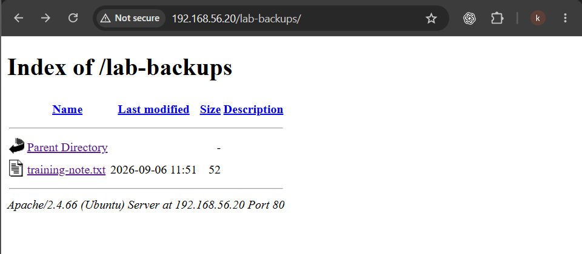

The finding was information disclosure. The listing revealed what was stored in the directory and provided a direct route to the file. In a real environment, exposed directories could contain backup archives, database exports, configuration copies or debug logs.

### Root cause

Three conditions produced the result:

- The requested directory was located under the public document root, `/var/www/html/`.
- It did not contain an index page.
- Apache was permitted to generate directory indexes.

The `autoindex` module being loaded was not sufficient by itself; the applicable Apache directory configuration also permitted indexing.

### First remediation: disable directory indexing

I created an Apache hardening configuration containing:

```apache
<Directory /var/www/html>
    Options -Indexes
</Directory>
```

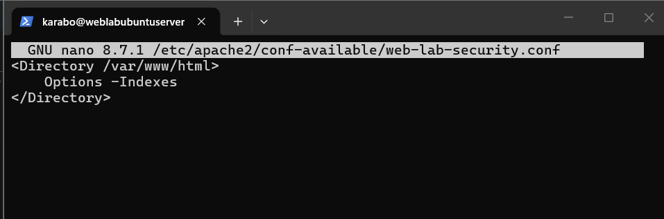

I enabled the configuration, validated it with `apache2ctl configtest`, reloaded Apache and confirmed that the service remained operational.

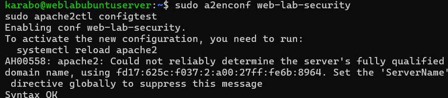

Requesting `/lab-backups/` then returned `403 Forbidden`, confirming that Apache would no longer generate a directory listing.

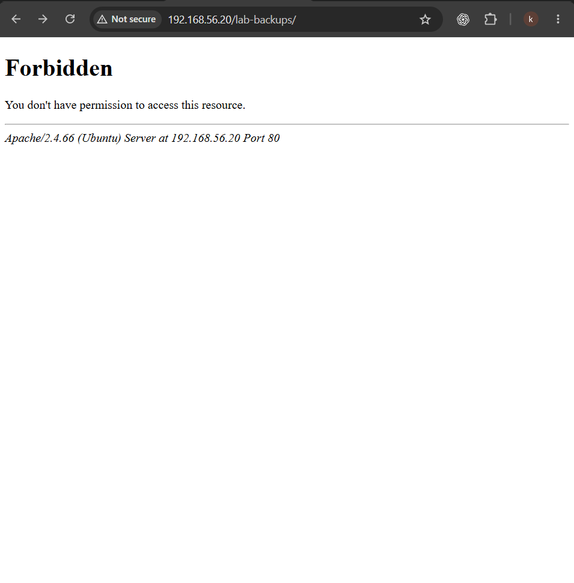

### Defense-in-depth observation

I requested the exact address of `training-note.txt` and confirmed that its contents were still readable. Disabling directory indexes prevented discovery through folder browsing, but it did not make a known public file private.

The stronger remediation was to move the file outside Apache's public web root:

```text
/var/www/html/lab-backups/training-note.txt
                    ↓
/var/backups/web-lab/training-note.txt
```

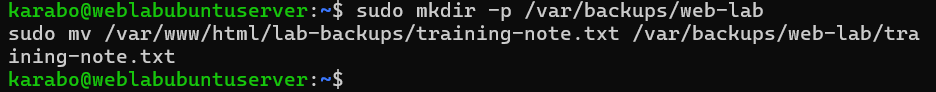

### Final retest

After the move, Apache could no longer serve the training file through its former URL.

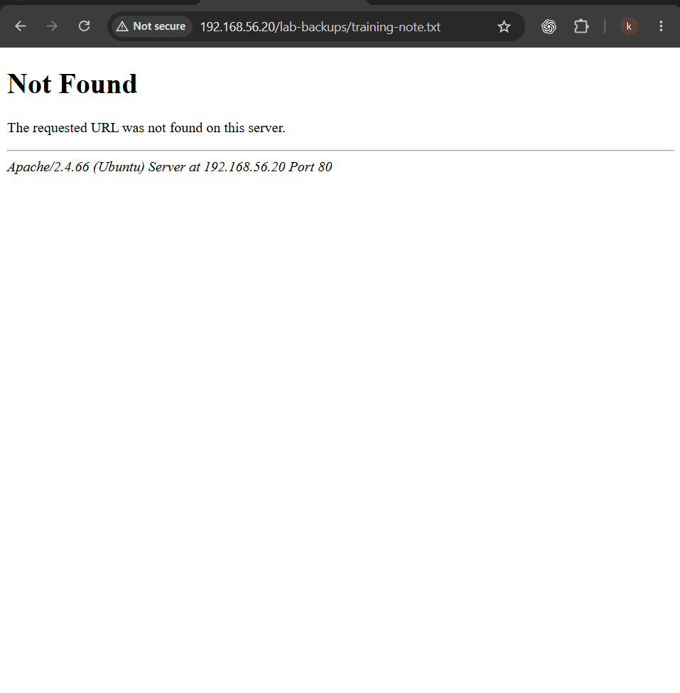

The directory test demonstrated defense in depth: disable unnecessary listing functionality and keep backups, databases, logs and private configuration outside the public document root.

## Test 2 — PHP and Apache error disclosure

### Secure baseline

The Apache-facing PHP configuration initially had `display_errors` disabled. This was the correct secure baseline because technical errors were not intended for browser visitors.

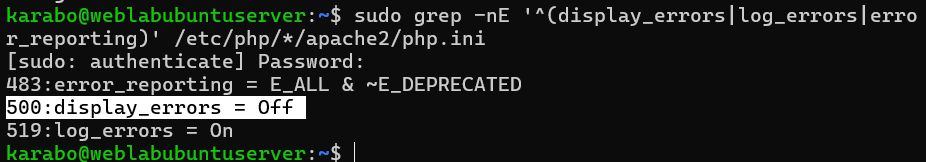

### Controlled vulnerable configuration

In the disposable clone, I temporarily enabled detailed error display while retaining logging:

```ini
display_errors = On
display_startup_errors = On
log_errors = On
error_reporting = E_ALL
```

I created `error-lab.php`, which deliberately generated a harmless warning, and reloaded Apache.

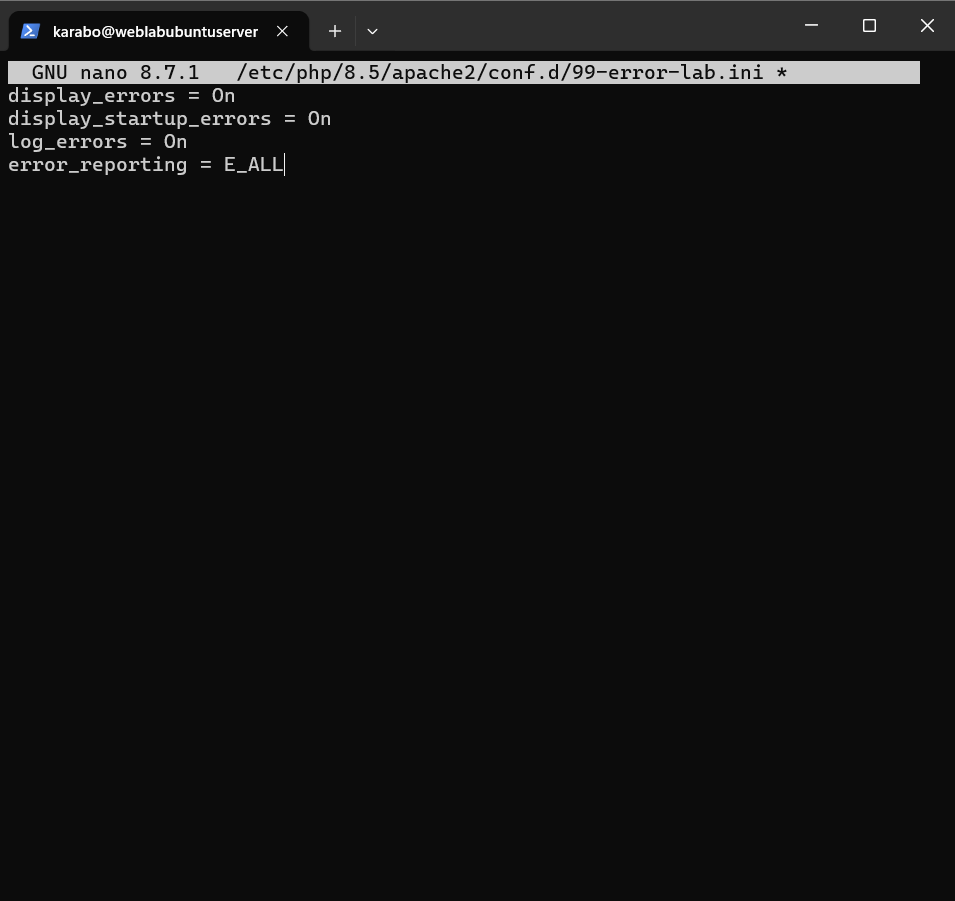

### Vulnerable-state result

The browser displayed a verbose error response. The observed output disclosed technical details including Apache information, Ubuntu, the server address and port 80. Such information can help an attacker fingerprint the environment and choose more focused follow-up tests.

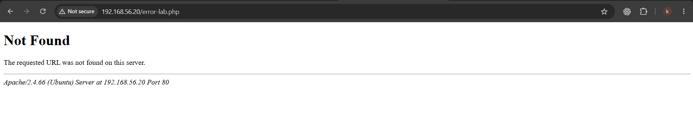

### Root cause

The PHP configuration sent detailed errors to the browser, while Apache's server signature disclosed more implementation information than a visitor required. Development-friendly diagnostics had become client-visible information.

### Remediation

I restored secure PHP error handling:

```ini
display_errors = Off
display_startup_errors = Off
log_errors = On
error_reporting = E_ALL
```

I also strengthened the Apache security configuration:

```apache
ServerTokens Prod
ServerSignature Off

<Directory /var/www/html>
    Options -Indexes
</Directory>
```

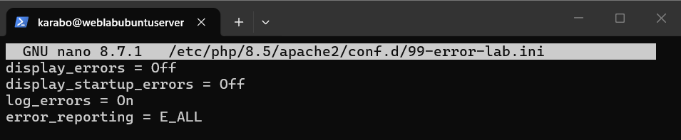

This design keeps diagnostic information available to administrators through protected logs while preventing it from being unnecessarily returned to visitors.

### Retest result

After validating the configuration and reloading Apache, I revisited the controlled error page. The browser no longer exposed the previous verbose technical information.

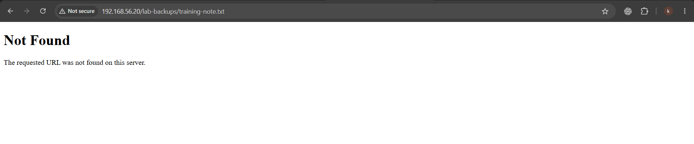

## Security impact

The exercise demonstrated confidentiality risks rather than server compromise. Directory listings can reveal filenames and make forgotten public artifacts easier to discover. Directly accessible backups or logs may disclose application data, source code, credentials or internal paths. Verbose errors can reveal software versions, operating-system details, paths and implementation clues.

Individually, each disclosure may appear small. Combined with another weakness, the information can materially improve an attacker's understanding of the target.

## Recommendations

- Disable directory indexing unless there is a documented requirement for it.
- Store backups, databases, logs and private configuration outside `/var/www/html/`.
- Treat `403 Forbidden` on a directory and protection of the directory's files as separate controls.
- Disable browser-facing PHP errors outside controlled development exercises.
- Keep error logging enabled and restrict access to the resulting logs.
- Minimize Apache version and operating-system disclosure with `ServerTokens Prod` and `ServerSignature Off`.
- Remove temporary diagnostic pages after testing.
- Validate configuration before reload and retest the exact exposed routes afterward.
- Repeat hardening consistently across development, testing and production environments.

## Lessons learned

This exercise showed me that application security is affected by every layer of the stack. Secure PHP queries and authorization checks do not protect a backup that has been placed inside a browser-accessible directory, and hiding a directory listing does not prevent direct access to a file whose address is already known.

I also learned the difference between displaying and logging errors. Visitors should receive minimal, generic responses, while administrators still need detailed information in protected logs for troubleshooting. The most effective remediation combined secure configuration with secure file placement instead of relying on a single control.

## Evidence and snapshots

Screenshots in `evidence/a02-security-misconfiguration/` preserve the configuration checks, controlled exposed states, remediations and retest results. VirtualBox snapshots were also taken during the exercise, including the exposed directory state and the final hardened states.

## Related documentation

- [A01 — Broken Access Control](A01-broken-access-control.md)
- [A05 — Injection](A05-injection.md)
- [A07 — Identification and Authentication Failures](A07-identification-and-authentication-failures.md)
- [Server components](../Web-application-architecture/02-server-components.md)
- [Application architecture](../Web-application-architecture/05-application-architecture.md)
- [Security design](../Web-application-architecture/06-security-design.md)
- [OWASP Top 10:2025 — A02 Security Misconfiguration](https://owasp.org/Top10/2025/A02_2025-Security_Misconfiguration/)
