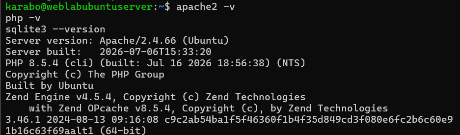
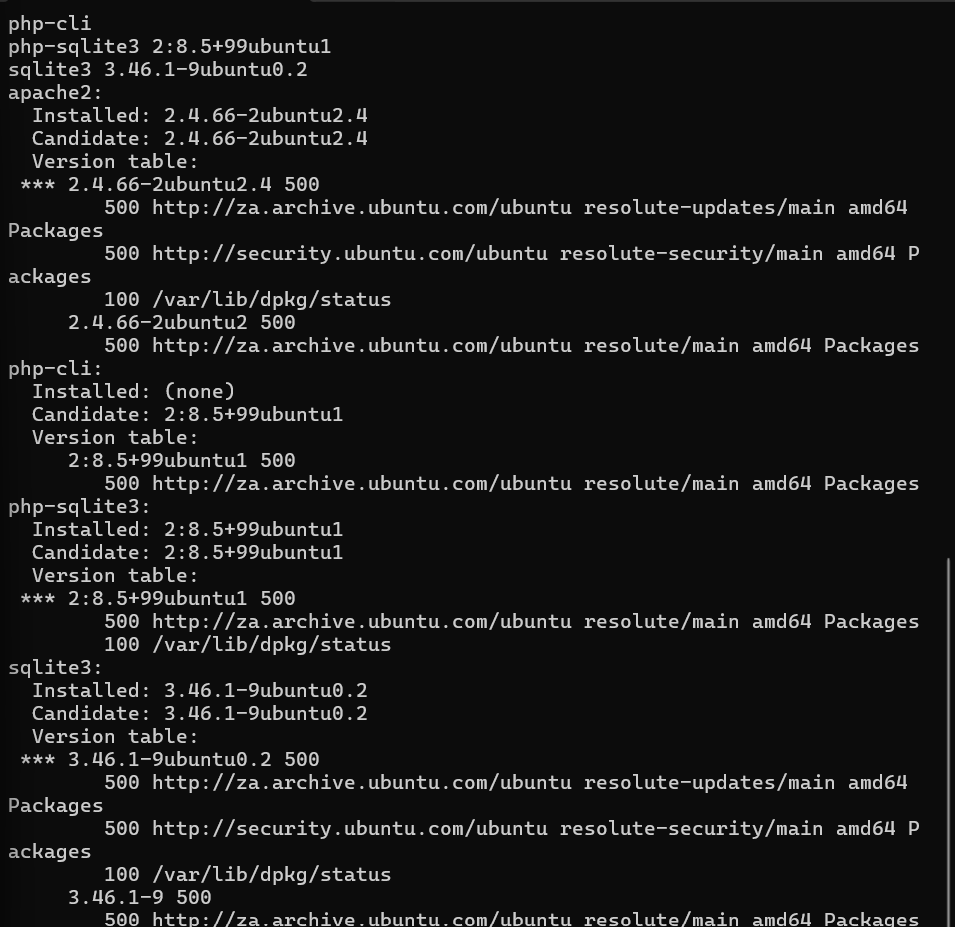
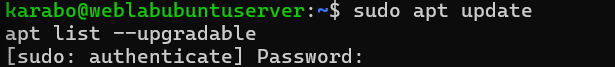

# A03 — Software Supply Chain Failures

## Executive summary

This exercise examined the software supporting my PHP and SQLite notes application: Ubuntu, Apache, PHP, SQLite and the PHP database extension. I inventoried component versions, inspected installed packages and configured repository sources, and completed a trusted-package maintenance workflow in my isolated VirtualBox lab.

This was a maintenance and verification exercise. I did not deliberately install vulnerable software or reproduce a supply-chain compromise. The learning record confirms completing the update workflow and returning the VM to isolated networking. The three retained screenshots support the inventory, package-source inspection and start of the update check; they do not show the final upgrade output.

## Classification and scope

| Item | Details |
| --- | --- |
| Learning category | A03:2025 — Software Supply Chain Failures |
| Focus | Component inventory, package sources and trusted updates |
| Environment | Owned Ubuntu Server training VM, Apache, PHP and SQLite |
| Administration | SSH from Windows PowerShell |
| Network | Host-Only lab; NAT temporarily enabled for package maintenance |
| Result | Maintenance workflow completed in the learning record; three supporting screenshots retained |

OWASP describes supply-chain risk as extending across dependencies and the processes used to build, distribute and update software. This exercise addresses a limited part of that scope: knowing the components installed on the lab server and maintaining them through configured Ubuntu repositories. See [OWASP A03:2025](https://top10.owasp.org/2025/A03_2025-Software_Supply_Chain_Failures/).

All administration was limited to my own lab. No third-party system was attacked and no malicious package was introduced.

## Learning objectives

- Identify the components on which the application depends.
- Distinguish a runtime version from an installed distribution-package version.
- Inspect installed and candidate packages and their repository sources.
- Understand the difference between refreshing package information and installing updates.
- Maintain the server without leaving the practice environment connected to the internet.

## Baseline and component inventory

The application was already functional. Rather than assume which versions were installed, I ran:

```bash
apache2 -v
php -v
sqlite3 --version
```

These commands ask each installed program to report its version. The retained inventory image shows:

| Component | Version shown at the time of the exercise |
| --- | --- |
| Apache | 2.4.66 (Ubuntu) |
| PHP CLI | 8.5.4 |
| SQLite | 3.46.1 |



These are historical observations, not a claim that the versions are currently supported, fully patched or free of vulnerabilities. The PHP command reports the CLI runtime; I did not separately capture the Apache PHP runtime version during this exercise.

## Installed packages and repository sources

I inspected package-manager information with:

```bash
dpkg-query -W -f='${binary:Package} ${Version}\n' apache2 php-cli php-sqlite3 sqlite3
apt-cache policy apache2 php-cli php-sqlite3 sqlite3
```

`dpkg-query` inspects the local package database. `apt-cache policy` shows installed versions, candidate versions and configured sources. The distribution revision is important because package maintenance is tracked at that level as well as through the upstream version number.



The visible package information includes:

| Package | Installed version shown | Candidate version shown |
| --- | --- | --- |
| apache2 | 2.4.66-2ubuntu2.4 | 2.4.66-2ubuntu2.4 |
| php-cli | (none) | 2:8.5+99ubuntu1 |
| php-sqlite3 | 2:8.5+99ubuntu1 | 2:8.5+99ubuntu1 |
| sqlite3 | 3.46.1-9ubuntu0.2 | 3.46.1-9ubuntu0.2 |

The screenshot lists `za.archive.ubuntu.com` and `security.ubuntu.com` sources. This documents the configured package origins; it is not a separate audit of signing keys or repository authenticity.

An important inventory observation is that `php -v` worked while the unversioned `php-cli` package showed `Installed: (none)`. A working PHP executable does not prove that this particular package name is installed. The exact package providing that executable was not resolved in the retained evidence and remains an inventory follow-up.

## Maintenance methodology

The recorded workflow was:

1. Inventory the stack and inspect package sources.
2. Temporarily enable NAT so Ubuntu could reach its package repositories.
3. Refresh the package lists and inspect available upgrades.
4. Apply available trusted updates.
5. Review remaining upgrades and check whether a reboot was required.
6. Return the training environment to isolated networking.

The commands discussed and followed in the learning session were:

```bash
sudo apt update
apt list --upgradable
sudo apt upgrade
```

`apt update` refreshes repository metadata; it does not install the listed upgrades. `apt list --upgradable` lists available package upgrades, and `apt upgrade` installs eligible updates. The post-update checks included the remaining upgrade list and `/var/run/reboot-required`.



This image stops at the sudo authentication prompt. It confirms that the update commands were entered, but does not independently demonstrate a successful repository refresh, an installed upgrade or a fully patched server.

## Results and evidence boundaries

| Observation | Evidence basis |
| --- | --- |
| Runtime versions inventoried | Version screenshot |
| Package versions and sources inspected | Package-policy screenshot |
| Update check initiated | Command-entry screenshot |
| Maintenance completed and isolation restored | User confirmations in the original learning conversation |
| Exact packages changed and final remaining-upgrade count | Not retained in the screenshots |
| Reboot requirement and any actual reboot | No retained result sufficient to state either outcome |
| Final snapshot `a03-updated-and-verified` | Suggested in the session; creation not explicitly confirmed |

The maintenance exercise is complete as a recorded learning activity. It does not establish that every installed component was audited or that every known vulnerability was removed.

## Risk and root-cause discussion

No compromised dependency or specific CVE was demonstrated. The risk examined was relying on supporting software without knowing its versions, sources or maintenance state. An application can have careful PHP authorization checks and still depend on an insecure runtime, web server or operating-system package.

The practical control was to establish an inventory, inspect the configured sources and follow a deliberate update process. A matching installed and candidate version reflects the available package information at that moment; it is not a universal security guarantee.

## Limitations and follow-up

- No software-composition scanner, CVE assessment or formal SBOM was produced.
- No malicious dependency, compromised build pipeline or package-signature bypass was tested.
- Repository signing keys and operating-system support status were not independently audited.
- The final upgrade transcript and post-maintenance application regression results were not retained.
- Future maintenance evidence should include final command output, remaining upgrades, reboot status and a brief application check.

## Lessons learned

Building the application helped me see that its software supply chain includes more than my own PHP files. The operating system, web server, runtime and database all influence the security of the application.

I learned to distinguish program-version output from package inventory, to inspect where updates come from, and to separate checking for updates from installing them. I also learned that evidence needs to show an outcome: a screenshot of a command being entered is useful context, but it cannot replace the final result.

## Related documentation

- [Server components](../Web-application-architecture/02-server-components.md)
- [Remote administration with SSH](../Web-application-architecture/03-remote-administration-with-ssh.md)
- [A06 — Insecure Design](A06-insecure-design.md)
- [OWASP testing index](README.md)
