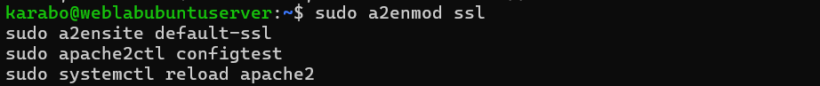
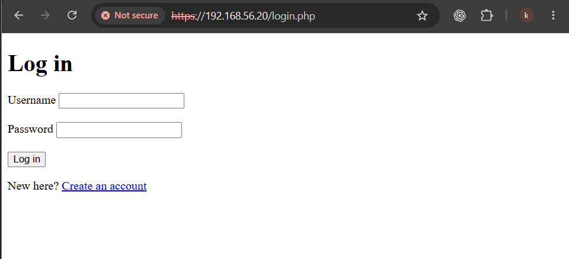
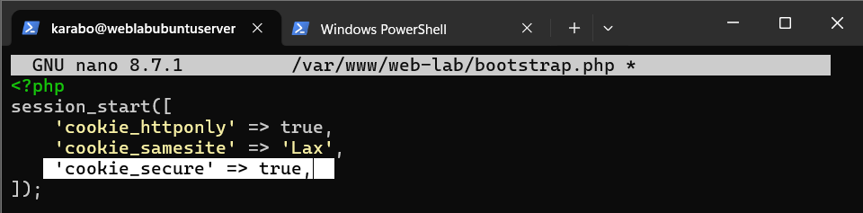
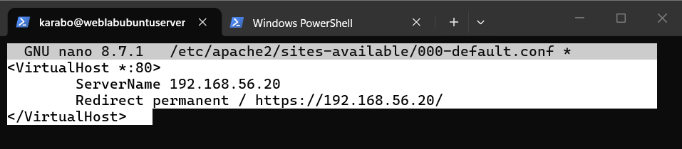
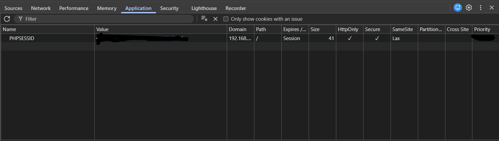

# A04 — Cryptographic Failures

## Executive summary

This exercise examined how the notes application protects credentials and session data in transit. The application already stored passwords with PHP's `password_hash()` and used `HttpOnly` and `SameSite=Lax` session-cookie protections, but it was served over unencrypted HTTP.

In the isolated Ubuntu Server lab, I enabled Apache SSL support, confirmed that the application loaded over HTTPS, configured the PHP session cookie with the `Secure` attribute, and redirected all HTTP requests to HTTPS. I then logged in, used the application over HTTPS and verified the session-cookie flags in the browser.

The lab uses a self-signed certificate, so the browser does not trust its identity automatically. This is acceptable for a private training environment, but a public deployment would require a valid certificate issued by a trusted certificate authority.

## Classification

| Item | Details |
| --- | --- |
| OWASP category | A04:2025 — Cryptographic Failures |
| Tested weakness | Application traffic and session cookies were not protected by enforced HTTPS |
| Threat model | Network traffic containing credentials or session information is exposed to interception or modification |
| Affected components | Apache virtual hosts, TLS configuration and PHP session-cookie settings |
| Security properties affected | Confidentiality and integrity of data in transit |
| Result | HTTPS enabled, HTTP redirected, secure cookie configured and browser flags verified |

## Scope and authorization

The exercise was performed only against my own PHP and SQLite notes application on an isolated VirtualBox Host-Only network. The Ubuntu Server clone, application, accounts and certificate were under my control. No public website, third-party account or external network was tested.

This was a configuration-hardening exercise. I did not intercept credentials, crack password hashes, weaken an encryption algorithm or attack certificate validation.

## Lab environment

| Component | Purpose |
| --- | --- |
| VirtualBox | Hosted the isolated Ubuntu Server clone |
| Ubuntu Server | Hosted the notes application |
| Apache | Terminated HTTPS and redirected HTTP requests |
| PHP | Managed authentication and session-cookie settings |
| SQLite | Stored user accounts and password hashes |
| Windows browser | Tested HTTPS, redirects and cookie attributes |
| SSH through PowerShell | Provided remote server administration |
| Self-signed certificate | Enabled encrypted transport inside the private lab |

Kali Linux was not needed because the objective was to configure and validate encrypted transport rather than capture or manipulate network traffic.

## Learning objectives

The exercise asked:

1. What information remains at risk when an authenticated application uses plain HTTP?
2. How does Apache provide HTTPS for the application?
3. How can the application ensure that its session cookie is sent only over HTTPS?
4. How can the server prevent users from remaining on the unencrypted HTTP version?
5. What is the difference between encryption and certificate trust?

## Existing protections

Before enabling HTTPS, the application already used several relevant controls:

- Passwords were stored using PHP's `password_hash()` rather than as plaintext.
- The session identifier was regenerated after successful login.
- `HttpOnly` prevented browser JavaScript from directly reading the PHP session cookie.
- `SameSite=Lax` reduced the circumstances in which the browser would send the cookie during cross-site navigation.

These controls did not encrypt the network connection. While the site remained on HTTP, credentials, cookies and application content were not protected by TLS while travelling between the browser and server.

## Baseline

The application was originally accessed through:

```text
http://192.168.56.20
```

The lab was isolated, which limited exposure, but the transport configuration did not represent an appropriate production deployment. The learning objective was to add and enforce encryption rather than intentionally weaken a secure implementation.

## Enabling HTTPS

I enabled Apache's SSL module and default SSL site, validated the configuration and reloaded Apache:

```bash
sudo a2enmod ssl
sudo a2ensite default-ssl
sudo apache2ctl configtest
sudo systemctl reload apache2
```



I then opened the application through:

```text
https://192.168.56.20
```

The application loaded successfully over HTTPS.



The browser continued to display a warning because the default lab certificate was self-signed. The `https://` address confirms use of TLS, but the warning correctly indicates that the browser cannot establish trust in the certificate issuer. I proceeded only because this was my own isolated lab.

## HTTPS-only session cookie

I updated the private session configuration in `/var/www/web-lab/bootstrap.php`:

```php
session_start([
    'cookie_httponly' => true,
    'cookie_samesite' => 'Lax',
    'cookie_secure' => true,
]);
```



The three cookie attributes address different risks:

| Attribute | Purpose |
| --- | --- |
| `HttpOnly` | Prevents JavaScript from directly reading the session cookie |
| `SameSite=Lax` | Restricts the cookie in certain cross-site request contexts |
| `Secure` | Instructs the browser to send the cookie only over HTTPS |

The `Secure` attribute depends on HTTPS being available. Enabling it while continuing to use HTTP would prevent the browser from sending the session cookie and could break authenticated sessions.

## Enforcing encrypted transport

I changed Apache's port 80 virtual host so that normal HTTP requests were permanently redirected to the HTTPS address:

```apache
<VirtualHost *:80>
    ServerName 192.168.56.20
    Redirect permanent / https://192.168.56.20/
</VirtualHost>
```



After validating and reloading Apache, I requested the original HTTP address and confirmed that the browser was redirected to HTTPS. This prevents ordinary users from remaining on the unencrypted version of the application.

## Validation methodology

1. Preserved the HTTP session baseline with a VirtualBox snapshot.
2. Enabled Apache's SSL module and default SSL site.
3. Validated the Apache configuration and reloaded the service.
4. Confirmed that the application loaded through the HTTPS address.
5. Added the `Secure` attribute to the PHP session-cookie configuration.
6. Configured Apache to redirect all port 80 requests to HTTPS.
7. Validated and reloaded Apache again.
8. Requested the original HTTP address and confirmed the redirect.
9. Logged in and used the notes application over HTTPS.
10. Inspected the PHP session cookie in the browser's developer tools.
11. Preserved the final state with the `a04-https-and-secure-session-fixed` snapshot.

## Validation result

The browser's cookie view showed that the `PHPSESSID` cookie had the expected `HttpOnly`, `Secure` and `SameSite=Lax` attributes.



The cookie value was redacted from the evidence image. The application remained usable after login and page refresh, confirming that the secure session cookie functioned over HTTPS.

The final transport flow became:

```text
Browser requests HTTP
        ↓
Apache returns a permanent HTTPS redirect
        ↓
Browser reconnects using TLS
        ↓
PHP session cookie is sent only over HTTPS
```

## Root cause and security impact

The original transport weakness existed because the application was served over HTTP and did not enforce encrypted communication. Application-layer controls such as password hashing do not protect a password while the browser is submitting it, and `HttpOnly` does not encrypt a session cookie on the network.

On an untrusted or compromised network, unencrypted application traffic may expose credentials, session identifiers, personal information or note content. It may also be modified while in transit. HTTPS provides confidentiality and integrity for the connection between the browser and server.

## Certificate limitation

The self-signed certificate enables encryption, but it does not provide the same identity assurance as a publicly trusted certificate. Because the browser cannot verify the issuer, it displays a warning.

For this isolated lab, the certificate is a practical way to learn TLS configuration. For a real deployment, users should never be trained to bypass certificate warnings. The server should use a certificate issued by a trusted authority, with correct hostnames, renewal and private-key protection.

## Methodology limitations

This exercise did not include:

- Capturing credentials or session cookies over HTTP
- Testing supported TLS versions or cipher suites
- Validating the certificate chain or hostname
- Testing HSTS behavior
- Auditing certificate expiry, renewal or private-key permissions
- Reviewing the algorithm and work factor selected by `password_hash()`
- Attempting to crack password hashes
- Testing encryption of data stored in the SQLite database

These remain separate future tests. The confirmed result is limited to HTTPS availability, HTTP redirection and session-cookie attributes.

## Recommendations

- Use a browser-trusted certificate for any public deployment.
- Keep HTTP-to-HTTPS redirection enabled.
- Retain `Secure`, `HttpOnly` and an appropriate `SameSite` value on session cookies.
- Regenerate session identifiers after authentication and privilege changes.
- Consider HSTS after HTTPS is fully and reliably deployed.
- Protect TLS private keys with restrictive ownership and permissions.
- Automate certificate renewal and monitor certificate expiry.
- Review supported TLS protocols and cipher suites against current guidance.
- Continue using adaptive password hashing and review its algorithm and work factor over time.
- Never commit certificates' private keys, session data or credentials to the repository.

## Lessons learned

This exercise showed me that password hashing, cookie flags and transport encryption solve different problems. Hashing protects stored passwords, `HttpOnly` limits browser-script access to a cookie, `SameSite` limits some cross-site use, and HTTPS protects information moving across the network.

I also learned that enabling HTTPS is not enough if users can continue using HTTP. The redirect and the cookie's `Secure` attribute work together to enforce the protected path. Finally, encryption does not automatically establish trust: a self-signed certificate can encrypt the lab connection while still producing a legitimate browser identity warning.

## Related documentation

- [A01 — Broken Access Control](A01-broken-access-control.md)
- [A02 — Security Misconfiguration](A02-security-misconfiguration.md)
- [A05 — Injection](A05-injection.md)
- [A07 — Authentication Failures](A07-identification-and-authentication-failures.md)
- [A09 — Security Logging and Alerting Failures](A09-security-logging-and-alerting-failures.md)
- [Server components](../Web-application-architecture/02-server-components.md)
- [Security design](../Web-application-architecture/06-security-design.md)
- [OWASP Top 10:2025 — A04 Cryptographic Failures](https://owasp.org/Top10/2025/A04_2025-Cryptographic_Failures/)
