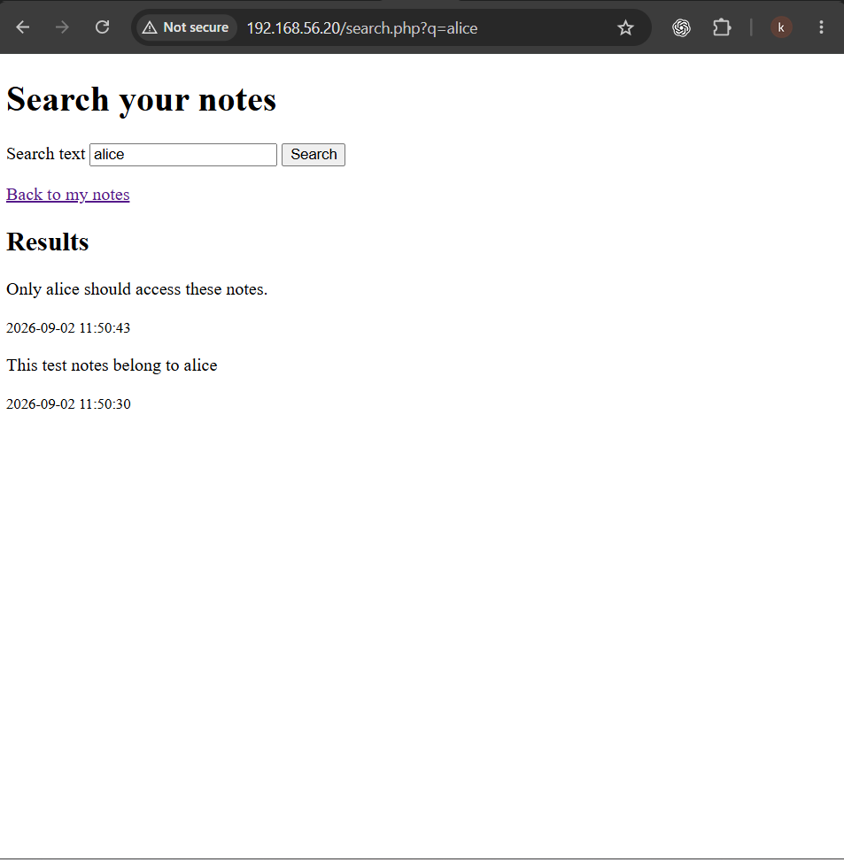
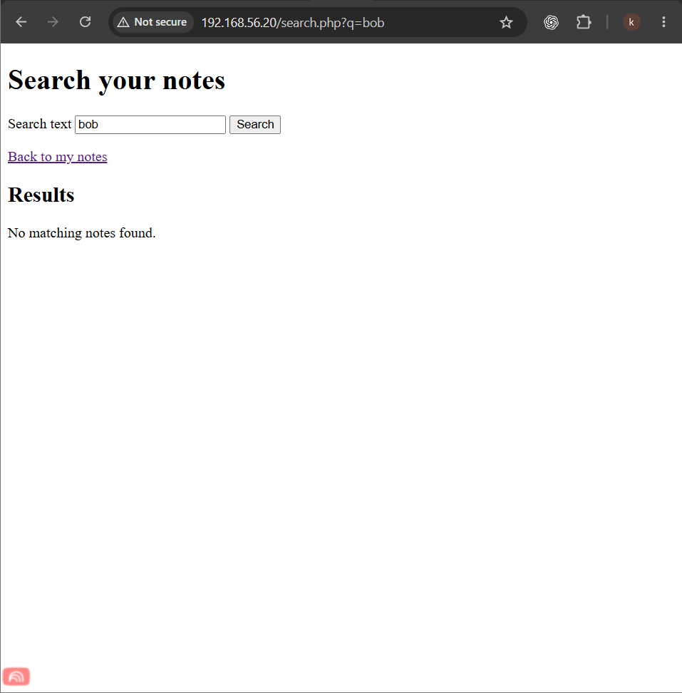
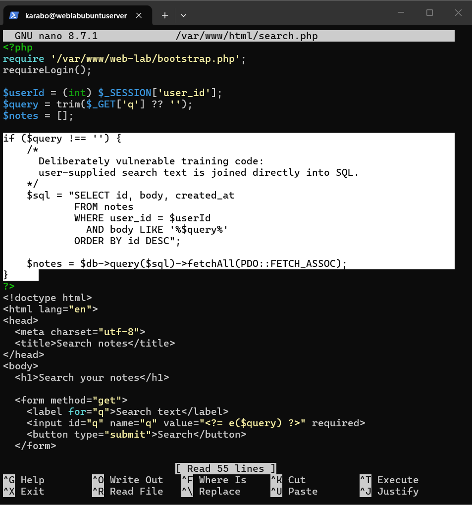
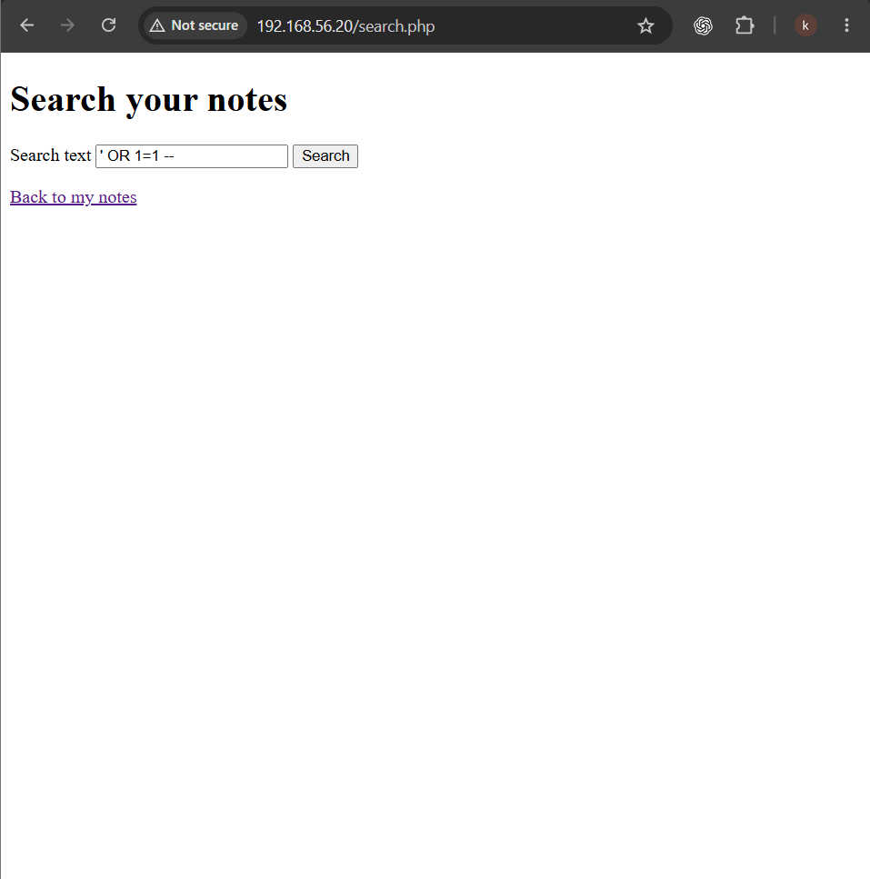
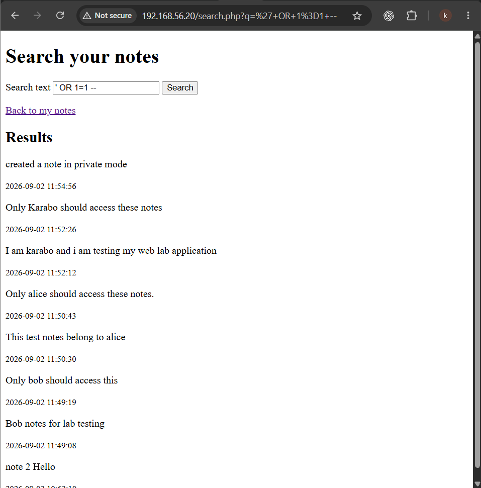
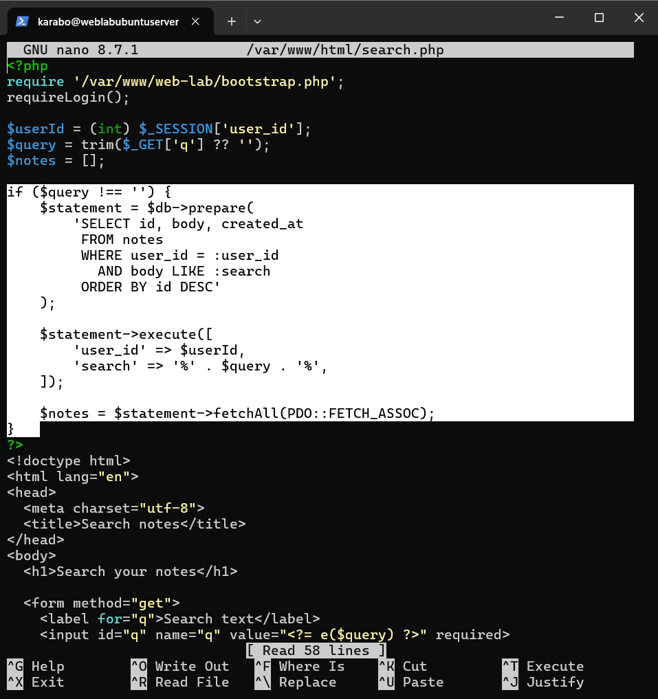
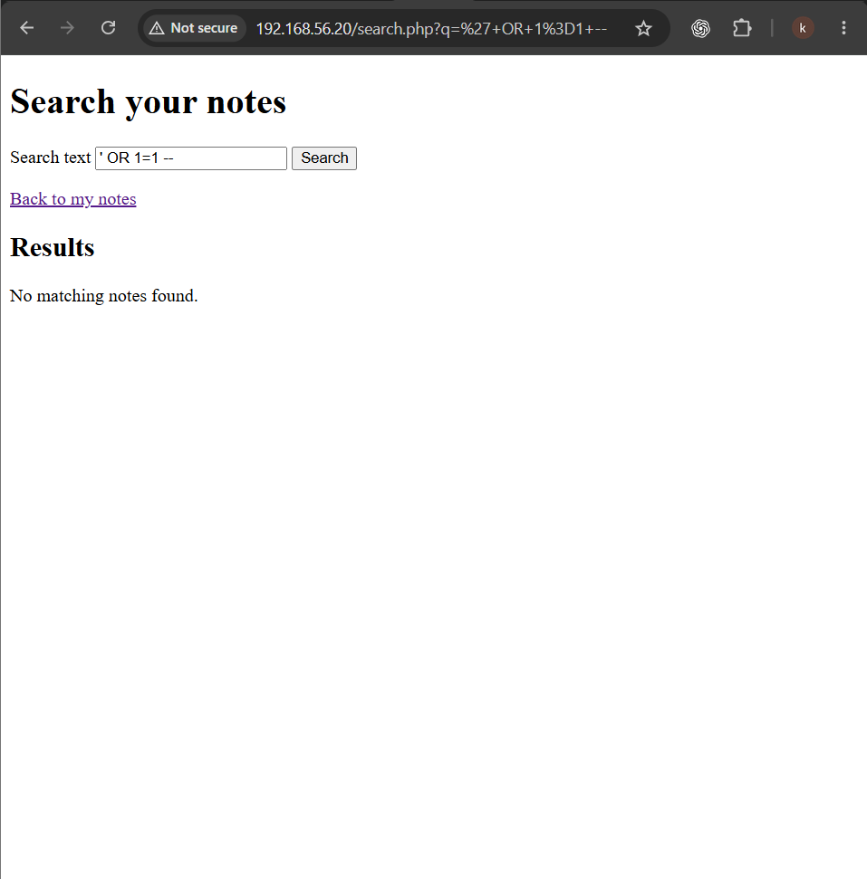

# A05 — Injection

## Executive summary

This exercise examined how SQL injection can occur when user-controlled input is joined directly into a database query. I created a note-search feature, verified its secure parameterized baseline, replaced the prepared statement with direct SQL construction in a disposable training clone, and submitted a controlled read-only payload.

While authenticated as Alice, the vulnerable search returned notes belonging to multiple users, including Bob. I restored the parameterized query and repeated the same input. The payload was then treated as ordinary search text and no unauthorized notes were returned.

## Classification

| Item | Details |
| --- | --- |
| OWASP category | A05: Injection |
| Tested weakness | User-controlled search text inserted directly into SQL |
| Threat model | An authenticated user changes a query to retrieve unauthorized records |
| Affected component | `search.php` and the SQLite notes table |
| Security properties affected | Confidentiality and authorization |
| Result | Baseline verified, injection reproduced, parameterization restored and retested |

## Scope and authorization

The exercise was performed only against my own PHP and SQLite notes application in an isolated VirtualBox lab. The unsafe implementation existed only in a disposable Ubuntu Server training clone. No public service, third-party account or external system was tested.

The test used the existing Alice and Bob laboratory accounts and a non-destructive payload designed only to demonstrate unauthorized reading. No data-changing statement was attempted.

## Lab environment

| Component | Purpose |
| --- | --- |
| VirtualBox | Hosted the isolated training clone |
| Ubuntu Server | Hosted the notes application |
| Apache and PHP | Served the application and processed searches |
| SQLite | Stored user accounts and notes |
| Windows browser | Submitted searches and the controlled payload |
| SSH through PowerShell | Provided remote administration |
| Host-Only network | Kept the exercise isolated |

Kali Linux was not used because the behavior could be demonstrated safely through Windows without running a second virtual machine on the 8 GB host.

## Learning objective

The exercise asked whether a parameterized search restricted results to the authenticated user, whether direct SQL construction allowed input to change the query, and whether restoring parameterization prevented the same input from being interpreted as SQL.

## Secure baseline

The protected search used named placeholders for both the authenticated user ID and search text:

```php
$statement = $db->prepare(
    'SELECT id, body, created_at
     FROM notes
     WHERE user_id = :user_id
       AND body LIKE :search
     ORDER BY id DESC'
);

$statement->execute([
    'user_id' => $userId,
    'search' => '%' . $query . '%',
]);
```

Logged in as Alice, I searched for `alice` and received Alice's matching notes.



Searching for `bob` returned `No matching notes found.` because the database query required the stored user ID to match Alice's authenticated session.



## Controlled vulnerable implementation

In the disposable clone, I replaced the prepared statement with direct string construction:

```php
$sql = "SELECT id, body, created_at
        FROM notes
        WHERE user_id = $userId
          AND body LIKE '%$query%'
        ORDER BY id DESC";

$notes = $db->query($sql)->fetchAll(PDO::FETCH_ASSOC);
```



The ownership condition remained present. The selected weakness was that `$query` became part of the SQL instruction instead of being bound as a data value.

## Test methodology

1. Verified ordinary searches and cross-user separation in the protected version.
2. Preserved the protected state with a snapshot.
3. Replaced only the parameterized search block in the disposable clone.
4. Confirmed that an ordinary search still worked.
5. Submitted the controlled read-only input `' OR 1=1 --` while logged in as Alice.
6. Confirmed that records belonging to other users were returned.
7. Preserved the confirmed vulnerable state with a snapshot.
8. Restored the prepared statement and parameter bindings.
9. Validated the PHP syntax and repeated the identical input.



## Vulnerable-state result

The payload changed the meaning of the unsafe SQL condition. The always-true expression caused records outside Alice's intended scope to be returned, while the comment sequence prevented the remaining SQL from restoring the original restriction.

The page displayed notes belonging to Alice, Bob and other laboratory accounts.



This confirmed SQL injection with a confidentiality impact. Alice was authenticated, but the application failed to keep her input separate from the database command.

## Root cause

The root cause was direct interpolation of `$query` into the SQL string. Once user input could modify the surrounding Boolean expression, the intended ownership restriction could be bypassed.

This differs from A01: the A01 vulnerable object lookup omitted ownership enforcement, whereas A05 retained the condition but allowed unsafe input to change how the SQL was evaluated.

## Security impact

The demonstrated impact was unauthorized disclosure of other users' notes. Depending on the affected query, database permissions and available functionality, injection could also enable unauthorized modification or deletion, authentication bypass, or disclosure of application structure. This controlled exercise demonstrated only unintended reading.

## Remediation

I restored the prepared statement and bound both dynamic values through `execute()`.



Prepared statements keep the SQL command structure separate from submitted values. SQLite therefore interprets the payload as text to search for rather than executable SQL syntax.

## Retest result

After restoring the protected implementation, I validated the PHP code and submitted the same input while logged in as Alice. The application returned no matching notes and did not disclose Bob's records.



The retest confirmed that parameterization prevented the submitted text from changing the database command.

## Additional observation

The repaired test produced an error during one validation attempt. The authorization objective was satisfied because no unauthorized records were returned, but a production application should present a generic response and log technical detail server-side. Any PHP, SQL, stack or filesystem information exposed by an error should be assessed separately as error disclosure or security misconfiguration.

## Recommendations

- Use prepared statements for every dynamic database value.
- Never build SQL by concatenating request parameters.
- Preserve authorization conditions such as `user_id = :user_id` in every relevant query.
- Give the application database only the permissions it requires.
- Return generic client-facing errors and keep technical details in protected logs.
- Retest representative injection strings against search, login and object-access functions.
- Continue using disposable, isolated and authorized training environments.

## Lessons learned

This exercise showed me that input validation and authorization rules cannot compensate for unsafe query construction. A query can contain the correct ownership condition and still fail if untrusted text becomes part of the SQL instruction.

It also reinforced why the same input must be used before and after remediation. The protected baseline established expected behavior, the vulnerable state demonstrated cross-user disclosure, and the final retest proved that the repair changed the outcome.

## Related documentation

- [A01 — Broken Access Control](A01-broken-access-control.md)
- [A07 — Identification and Authentication Failures](A07-identification-and-authentication-failures.md)
- [Application architecture](../Web-application-architecture/05-application-architecture.md)
- [Security design](../Web-application-architecture/06-security-design.md)
- [OWASP Top 10: A05 Injection (2025)](https://owasp.org/Top10/2025/A05_2025-Injection/)
