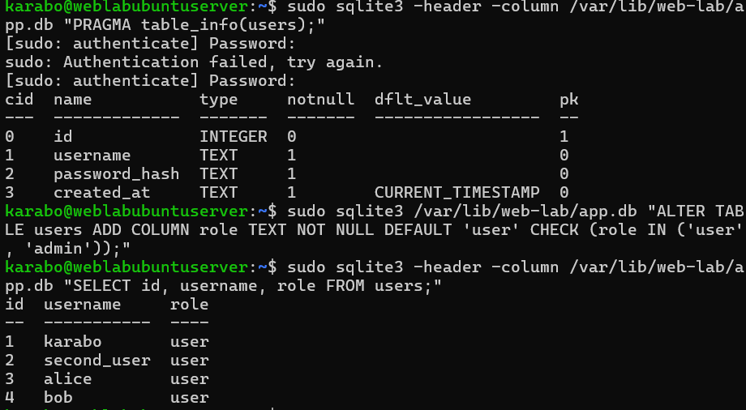
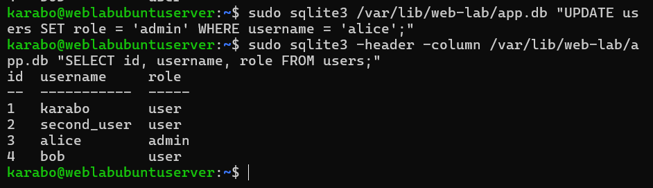
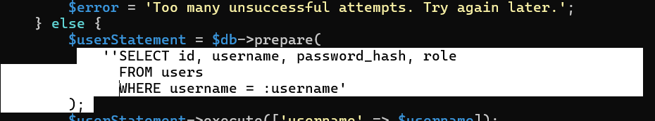
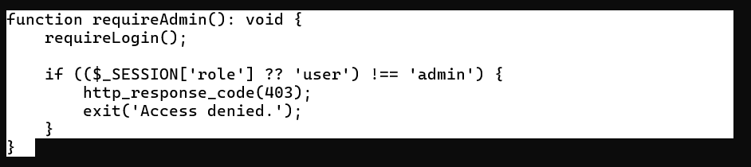
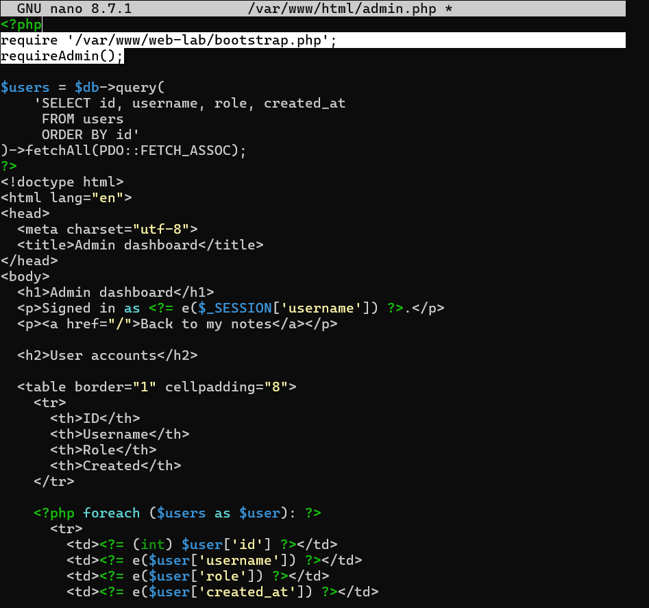
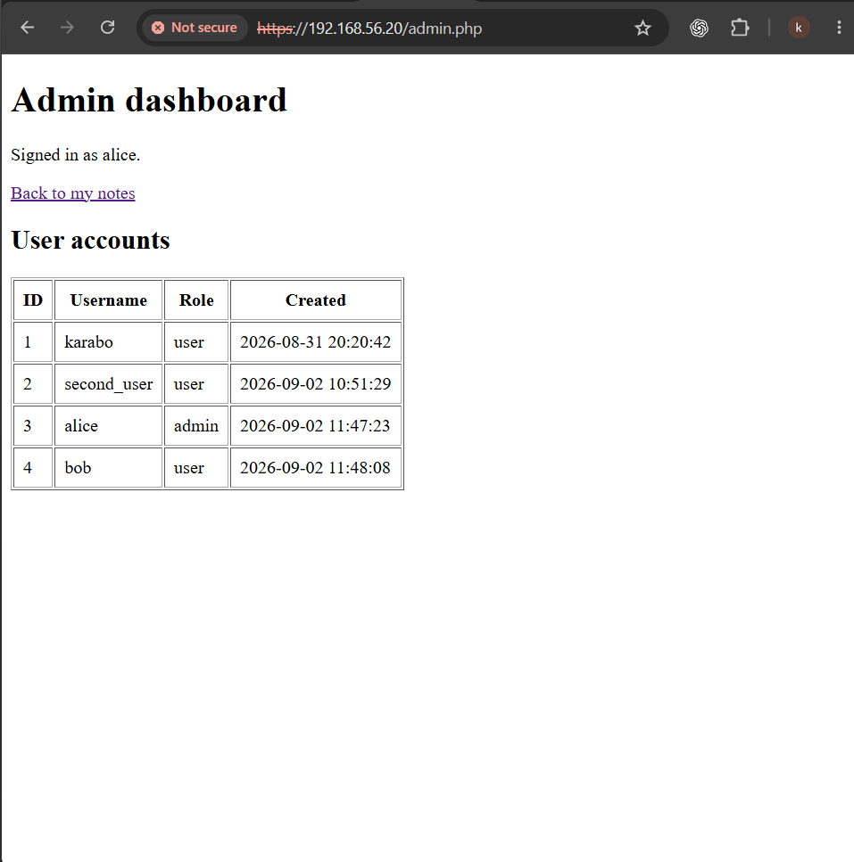
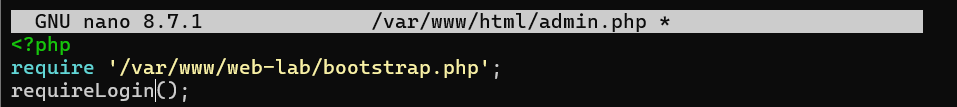
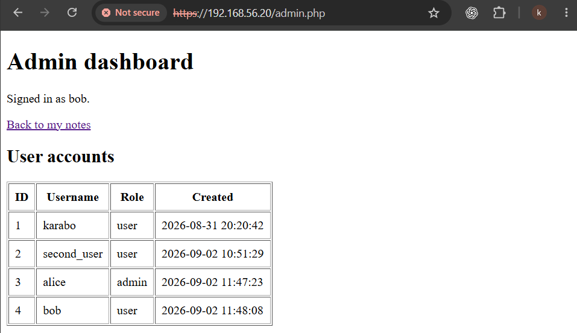
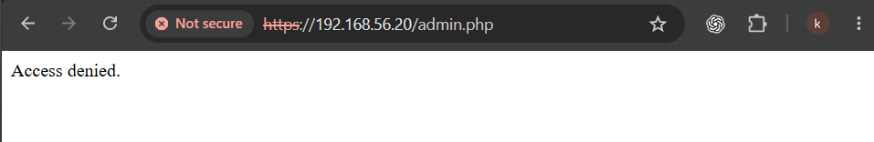

# A06 — Insecure Design

## Executive summary

This exercise began by defining user and administrator permissions before implementing an administrator dashboard in my PHP and SQLite notes application. New and existing accounts received the ordinary `user` role by default. I manually promoted Alice to `admin`, loaded the database role into the login session, and protected the new account-list page with a reusable server-side `requireAdmin()` check.

After verifying that Alice could access the page and Bob could not, I deliberately replaced `requireAdmin()` with `requireLogin()` in the disposable training clone. Bob could then view the administrator account list despite retaining his ordinary role. I restored the administrator check and confirmed that access was denied again.

## Classification and scope

| Item | Details |
| --- | --- |
| Learning category | A06:2025 — Insecure Design |
| Design objective | Define least-privilege roles and enforce administrator-only operations |
| Demonstrated weakness | Missing administrator authorization on an authenticated endpoint |
| Related category | A01:2025 — Broken Access Control |
| Endpoint | `/admin.php` |
| Accounts | Alice: administrator; Bob: ordinary user |
| Observed impact | Bob gained access to account IDs, usernames, roles and creation dates |
| Result | Administrator guard restored; Bob denied access on retest |

OWASP distinguishes insecure design from implementation defects. This exercise is filed under A06 because it teaches defining and validating role requirements before building a feature. The deliberately removed role check is specifically an implementation-level broken-access-control flaw; the demonstration does not establish that the original permission model itself was insecure. See [OWASP A06:2025](https://top10.owasp.org/2025/A06_2025-Insecure_Design/).

All changes and tests were limited to my own application and accounts in an isolated VirtualBox training clone. I used a Windows browser for application tests and SSH from Windows for server administration. No public system was targeted.

## Learning objectives and intended design

Before writing the dashboard, I defined the permission boundary:

| Action | Ordinary user | Administrator |
| --- | --- | --- |
| Log in and manage own notes | Allowed | Allowed |
| View another user's private notes | Not allowed | Not granted by the administrator role |
| View the account-list dashboard | Not allowed | Allowed |
| Choose `admin` during registration | Not allowed | Not allowed |
| Change account roles through the web application | Not provided | Not provided |

Role promotion was performed manually through server administration. The dashboard was limited to account metadata; it did not provide note access, password hashes, session values or account-editing functions. Hiding a navigation link would not satisfy the administrator-only requirement because users can request the endpoint directly.

## Database roles

I inspected the user table and added a constrained role column:

```sql
ALTER TABLE users
ADD COLUMN role TEXT NOT NULL DEFAULT 'user'
CHECK (role IN ('user', 'admin'));
```

The default provides an ordinary role when an insert omits the field. The constraint restricts stored values to the two defined roles; it does not by itself prevent application code from explicitly inserting `admin`.



I then promoted Alice through the server's SQLite administration interface:

```sql
UPDATE users SET role = 'admin' WHERE username = 'alice';
```



## Login and session integration

The login query was extended to retrieve the role alongside the account identity and password hash:

```php
$userStatement = $db->prepare(
    'SELECT id, username, password_hash, role
     FROM users
     WHERE username = :username'
);
```



After successful password verification, the application regenerated the session identifier and stored the database-sourced role:

```php
session_regenerate_id(true);
$_SESSION['user_id'] = (int) $user['id'];
$_SESSION['username'] = $user['username'];
$_SESSION['role'] = $user['role'];
```


I logged out and back in so the session contained the role. During implementation, an extra quote before the SQL `SELECT` caused a PHP parse error. I corrected the string and completed the login syntax-check step before continuing.

## Server-side administrator guard

I added this helper to the private `/var/www/web-lab/bootstrap.php` file:

```php
function requireAdmin(): void {
    requireLogin();

    if (($_SESSION['role'] ?? 'user') !== 'admin') {
        http_response_code(403);
        exit('Access denied.');
    }
}
```

The helper first requires authentication, then checks the role. An absent role defaults to ordinary-user permissions. A signed-in non-administrator is denied before the protected page retrieves account data.



The new dashboard began with:

```php
require '/var/www/web-lab/bootstrap.php';
requireAdmin();
```

Only after the guard ran did the page select `id`, `username`, `role` and `created_at` from the user table. Displayed text used the existing escaping helper.



## Secure baseline

I opened `https://192.168.56.20/admin.php` as Alice and confirmed that the account list was visible. I also tested Bob and confirmed that he could not access the page before introducing the weakness.



The browser's certificate warning reflects the existing self-signed lab certificate. It is separate from the role-authorization test.

## Controlled weakness and reproduction

In the disposable clone, I changed only the page guard:

```php
require '/var/www/web-lab/bootstrap.php';
requireLogin(); // Deliberately vulnerable training state.
```



Retaining `requireLogin()` isolated the authorization failure. Removing the guard entirely would also remove the explicit authentication check and broaden the experiment.

I signed in as Bob and directly requested the administrator page. The dashboard displayed the account list, even though its own table still identified Bob as `user`.



This was vertical privilege escalation in the capability Bob could exercise. His stored role was not changed to `admin`.

## Root cause and security impact

The endpoint checked whether the visitor was signed in but no longer checked whether that visitor was an administrator. Authentication was therefore treated as sufficient permission for a privileged operation.

The observed disclosure was limited to account metadata: IDs, usernames, roles and creation dates. The test did not demonstrate access to private notes, password hashes, role-changing functions or server administration. More powerful endpoints would require their own assessment; their compromise cannot be inferred from this read-only dashboard test.

## Remediation and retest

I restored `requireAdmin()` immediately after the private bootstrap include and before the account query. I then repeated the direct request as Bob and confirmed that access was denied, while the administrator access check remained successful in the recorded retest.



| State | Alice, administrator | Bob, ordinary user |
| --- | --- | --- |
| Protected baseline | Account list visible | Access denied |
| Login-only training state | Still permitted by the code | Account list visible in screenshot |
| Restored administrator guard | Access retained in the recorded retest | Access denied |

The denial screenshot shows the response body, not the active username or the HTTP response headers. Attribution to Bob and the repair sequence comes from the learning conversation. The guard explicitly sets HTTP 403, but no independent HTTP-status capture is included. The screenshots separately establish Alice's authorized access and Bob's unintended access.

## Snapshot and evidence record

Ten retained screenshots document the schema, role assignment, login integration, guard, dashboard and browser results. The original conversation records completion of the protected, vulnerable and repaired states.

The proposed snapshot names were `a06-role-design-baseline`, `a06-role-based-access-verified`, `a06-admin-authorization-vulnerable` and `a06-role-design-fixed-verified`. No snapshot-manager evidence is included. In particular, the final snapshot was suggested after the last completion message, so its creation is not claimed here.

## Limitations and future checks

- Registration request tampering to submit an explicit `admin` role was not tested; the design prohibits it, but the default alone is insufficient evidence of enforcement.
- The role is cached in the session. Immediate revocation after a database role change was not implemented or tested; a production design should address stale privileged sessions.
- An anonymous request to the vulnerable page was not separately captured. Retained `requireLogin()` expresses the intended authentication protection.
- No automated authorization tests, session-tampering tests or role-change audit events were added in this exercise.
- The permission model describes private-note boundaries, but no additional administrator cross-user-note test was performed during A06.

## Lessons learned

I learned to write down who may perform an operation before implementing it, then verify that the server enforces the rule at the endpoint. A role field and a successful login are not enough: the application must use that role when deciding whether to return privileged data.

Replacing the administrator guard with a login-only guard made the difference between identity and permission visible. Restoring the control and repeating the same request showed why testing the repaired behaviour is as important as demonstrating the weakness.

## Related documentation

- [A01 — Broken Access Control](A01-broken-access-control.md)
- [A03 — Software Supply Chain Failures](A03-software-supply-chain-failures.md)
- [A07 — Authentication Failures](A07-identification-and-authentication-failures.md)
- [Security design](../Web-application-architecture/06-security-design.md)
- [OWASP testing index](README.md)
