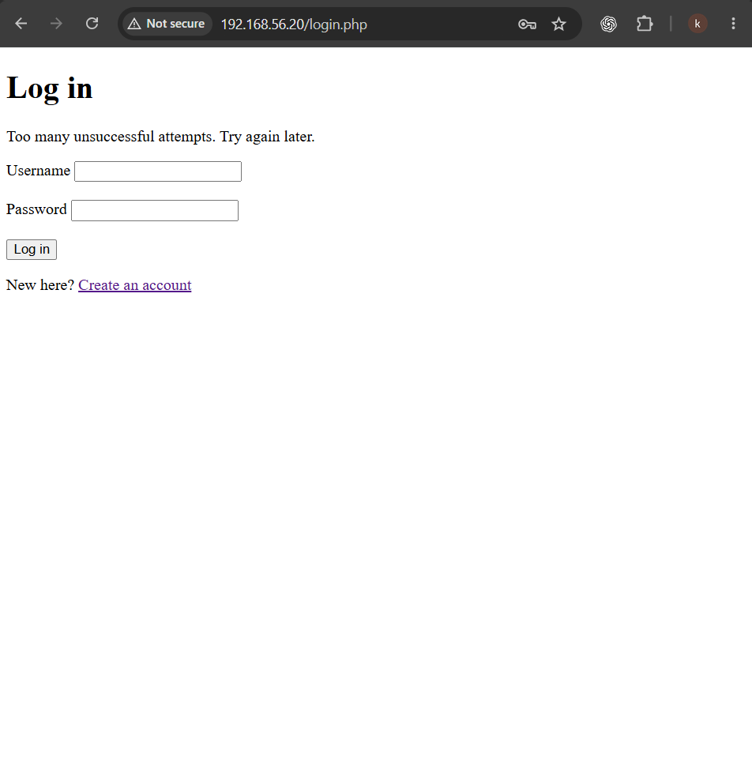
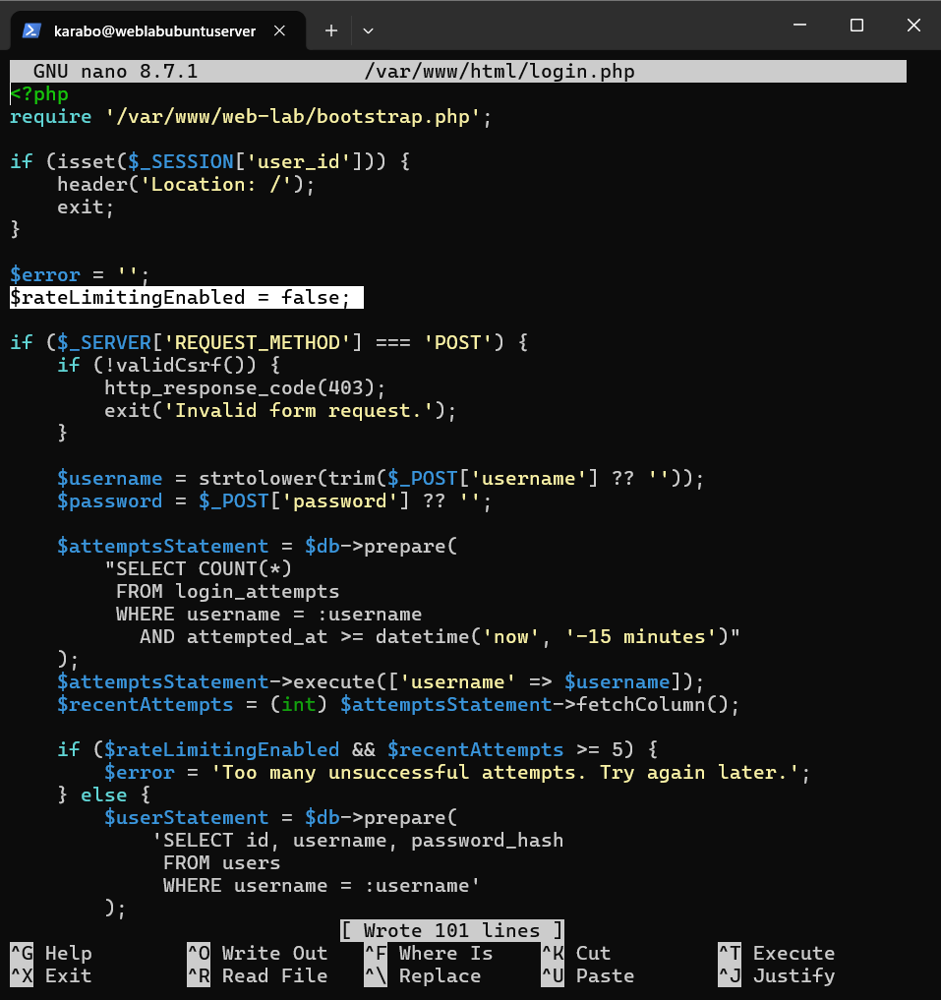
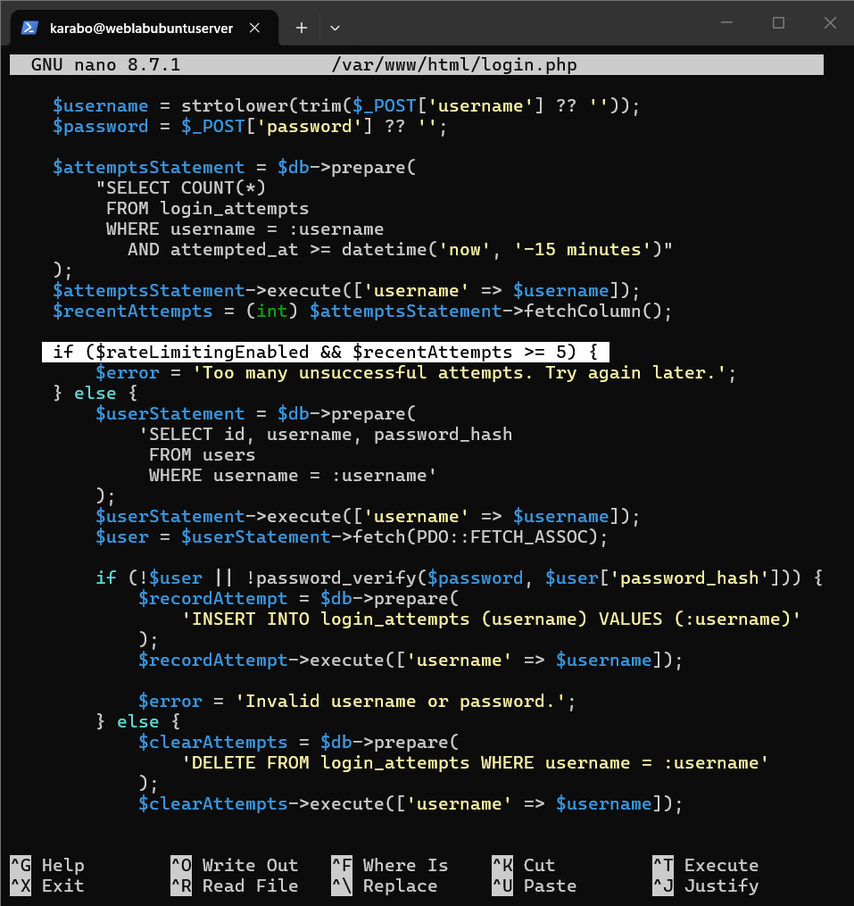
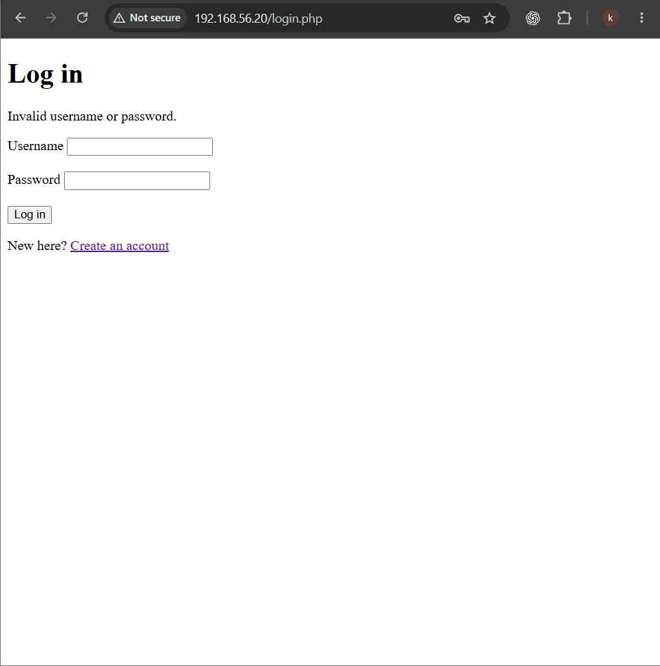
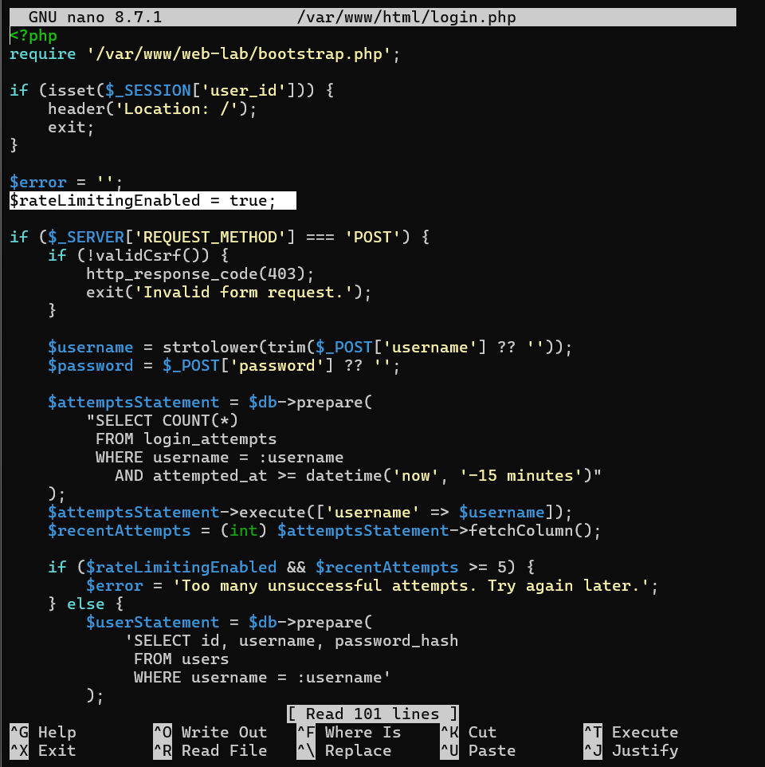
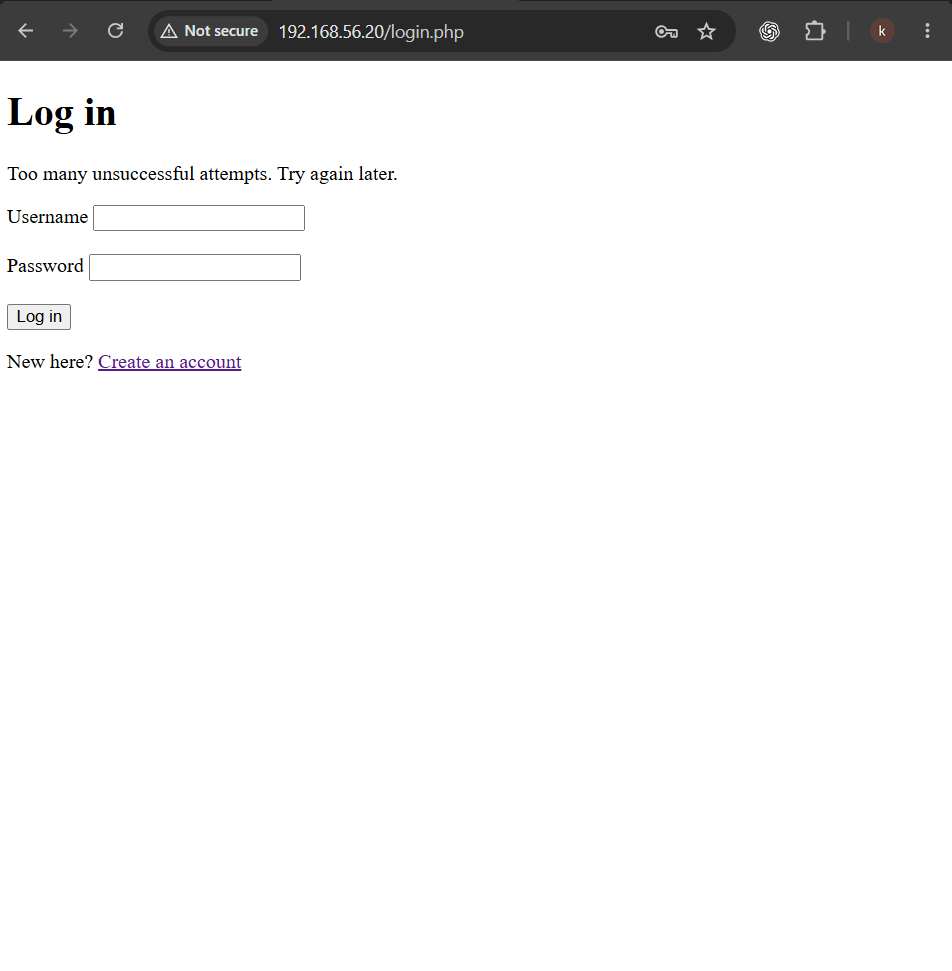

# A07 — Identification and Authentication Failures

## Executive summary

This exercise examined how login-rate limiting protects an application from repeated password guesses. I implemented a server-side control that temporarily rejected further login attempts after five unsuccessful attempts for the same username within 15 minutes. I verified the protected baseline, deliberately disabled the enforcement condition in a disposable training clone, confirmed that additional incorrect passwords continued to be processed, restored the protection, and repeated the test.

With rate limiting enabled, the sixth incorrect attempt was rejected with `Too many unsuccessful attempts. Try again later.` With enforcement disabled, attempts beyond the threshold continued to return the normal `Invalid username or password.` response. After I restored the control, the temporary restriction returned.

This demonstrated that secure password storage is only one part of authentication security. An application must also restrict repeated login activity and maintain the server-side state required to recognize abuse.

## Classification

| Item | Details |
| --- | --- |
| OWASP category | A07: Identification and Authentication Failures |
| Tested weakness | Missing login-rate-limit enforcement |
| Threat model | Repeated password guessing against a user account |
| Affected component | `login.php` and the SQLite login-attempt records |
| Security properties affected | Authentication security and account availability |
| Result | Protected baseline verified, weakness reproduced, protection restored and retested |

## Scope and authorization

The exercise was performed only against my own PHP and SQLite notes application in an isolated VirtualBox lab. The deliberately weak state existed only in a disposable Ubuntu Server training clone. No public service, third-party account or external system was tested.

The test used a dedicated lab account and deliberately incorrect passwords. No password list, credential leak or external account was involved.

## Lab environment

| Component | Purpose |
| --- | --- |
| VirtualBox | Hosted the isolated server environment |
| Ubuntu Server | Hosted the notes application |
| Apache | Served the PHP application over HTTP |
| PHP | Implemented the authentication and rate-limiting logic |
| SQLite | Stored users and failed-login records |
| Windows browser | Submitted the controlled login attempts |
| SSH through PowerShell | Provided remote administration of the server |
| Host-Only network | Kept the application isolated from public exposure |

Kali Linux was not required for this exercise. The security control could be evaluated by submitting a small number of manual requests through the Windows browser, which avoided running another virtual machine on an 8 GB laptop.

## Learning objective

The exercise was designed to answer three questions:

1. Does the application restrict repeated incorrect passwords?
2. What happens when the enforcement condition is deliberately disabled?
3. Does the restriction return after the protection is restored?

## Security design

The protected implementation records unsuccessful login attempts in a server-side SQLite table. Each record contains the targeted username and the time of the attempt.

The table was created with the following structure:

```sql
CREATE TABLE IF NOT EXISTS login_attempts (
    id INTEGER PRIMARY KEY AUTOINCREMENT,
    username TEXT NOT NULL,
    attempted_at TEXT NOT NULL DEFAULT CURRENT_TIMESTAMP
);

CREATE INDEX IF NOT EXISTS idx_login_attempts_username_time
ON login_attempts(username, attempted_at);
```

The index supports the query that counts recent failures for a username.

## Protected authentication flow

The protected login process:

1. Validates the CSRF token.
2. Normalizes the submitted username using `strtolower()` and `trim()`.
3. Counts failed attempts for that username during the previous 15 minutes.
4. Rejects the request when five or more recent attempts exist.
5. Retrieves the user with a parameterized query when the threshold has not been reached.
6. Records another attempt if the username or password is incorrect.
7. Clears that username's attempts following successful authentication.
8. Regenerates the session ID before creating the authenticated session.

The relevant enforcement logic was:

```php
$attemptsStatement = $db->prepare(
    "SELECT COUNT(*)
     FROM login_attempts
     WHERE username = :username
       AND attempted_at >= datetime('now', '-15 minutes')"
);
$attemptsStatement->execute(['username' => $username]);
$recentAttempts = (int) $attemptsStatement->fetchColumn();

if ($rateLimitingEnabled && $recentAttempts >= 5) {
    $error = 'Too many unsuccessful attempts. Try again later.';
}
```

## Secure baseline test

I began with rate limiting enabled:

```php
$rateLimitingEnabled = true;
```

I submitted an incorrect password repeatedly for the dedicated test account. The first five attempts returned the generic authentication error. The sixth attempt was rejected with:

```text
Too many unsuccessful attempts. Try again later.
```

This established that the security control was working before I introduced the controlled weakness.



## Controlled weak implementation

In the disposable training clone, I deliberately disabled enforcement by changing the Boolean value:

```php
$rateLimitingEnabled = false;
```



The conditional statement remained in the application:

```php
if ($rateLimitingEnabled && $recentAttempts >= 5) {
    $error = 'Too many unsuccessful attempts. Try again later.';
}
```

Because the first condition was `false`, PHP did not enforce the threshold even when `$recentAttempts` was five or greater.



This training switch made the protected and weak states easy to compare without removing the rest of the authentication implementation.

## Test methodology

1. I verified that the protected version restricted the sixth incorrect login.
2. I preserved the protected training state with a snapshot.
3. I changed `$rateLimitingEnabled` from `true` to `false` in the disposable clone.
4. I submitted more than five incorrect passwords against the dedicated account.
5. I observed whether the temporary restriction appeared.
6. I restored `$rateLimitingEnabled` to `true`.
7. I submitted another incorrect password.
8. I confirmed that the temporary restriction returned.

## Vulnerable-state result

With enforcement disabled, attempts beyond the threshold continued to reach the normal authentication-failure path. The application returned:

```text
Invalid username or password.
```

It did not display the temporary restriction. This confirmed that the application would continue processing password guesses when the rate-limit enforcement condition was disabled.



The screenshot represents an attempt beyond the configured five-attempt threshold. The test was conducted manually and did not involve automated brute-force tooling.

## Finding

The controlled weak version demonstrated an authentication failure caused by missing rate-limit enforcement. The application still rejected incorrect credentials, but it did not meaningfully restrict the number of guesses that could be submitted during the test window.

This matters because an authentication endpoint can be functionally correct while remaining vulnerable to repeated password guessing. Password hashing protects stored credentials; it does not restrict the number of authentication attempts an attacker can make.

## Security impact

Without a rate limit, an attacker could submit many password guesses against the login endpoint. The practical impact would depend on password strength, request volume, monitoring, network controls and other authentication protections.

Potential consequences include:

- Increased exposure to password guessing and credential-stuffing attacks.
- Greater likelihood of account compromise when users select weak or reused passwords.
- Increased processing and database activity at the authentication endpoint.
- Reduced visibility if repeated failures are not logged and monitored.

This exercise demonstrated the absence of an attempt restriction. It did not attempt to compromise an account and does not claim that a password was discovered.

## Root cause

The application collected the information required to recognize repeated failures, but the deliberately weak configuration prevented the enforcement branch from running.

The root cause was therefore not password verification or SQL handling. It was the disabled decision point that should have restricted further authentication activity after the configured threshold.

## Remediation

I restored the Boolean value to its protected state:

```php
$rateLimitingEnabled = true;
```



The restored implementation again enforced both required conditions:

```text
Rate limiting is enabled
AND
At least five recent failures exist for the username
```

## Retest result

After restoring the protection, I repeated the incorrect login request. Because the failed-attempt records were still present, the application immediately returned:

```text
Too many unsuccessful attempts. Try again later.
```



The retest confirmed that the enforcement control had been restored successfully.

## Outcome flow

```text
Protected baseline
    Five incorrect attempts recorded
    Sixth attempt temporarily rejected
                |
                v
Controlled weak state
    Enforcement Boolean set to false
    Attempts beyond the threshold continue
                |
                v
Restored state
    Enforcement Boolean set to true
    Temporary restriction returns during retest
```

## Strengths retained during the exercise

The training change disabled only the selected control. The application continued to use:

- CSRF validation for the submitted login form.
- Username normalization.
- Parameterized database queries.
- `password_verify()` for password validation.
- A generic message for ordinary authentication failures.
- Server-side records of failed attempts.
- Session-ID regeneration following successful authentication.
- Clearing of the username's attempt records after successful authentication.

Isolating one weakness made it possible to connect the observed behaviour to the specific control being tested.

## Limitations of the current control

This implementation is appropriate for a learning application, but a production authentication service would require additional design work.

### Username-only limiting

The threshold is associated with a username. This can restrict repeated guesses against an account, but it may also allow someone to intentionally trigger a temporary restriction against another user.

### Distributed attempts

Account-only rate limiting does not fully address guessing distributed across many usernames, IP addresses or devices. Production systems commonly combine several signals and progressive controls.

### Accumulation of old records

Attempts older than 15 minutes are excluded from the count, but the current design should also include a safe cleanup process so that expired records do not accumulate indefinitely.

### Training switch

The Boolean switch exists to make the security comparison clear inside the disposable clone. A production system should not expose an easy or client-controlled way to disable authentication protections.

## Recommendations

- Enforce rate limits on the server rather than in client-side code.
- Combine account-based and network-based signals where appropriate.
- Consider progressive delays before applying a complete temporary restriction.
- Log authentication failures and monitor unusual patterns.
- Use generic authentication errors that do not confirm account existence.
- Add automated tests covering attempts below, at and above the configured threshold.
- Test the expiration of the time window and successful-login reset behaviour.
- Remove expired attempt records through a controlled cleanup process.
- Protect security configuration from unauthorized modification.
- Continue using snapshots and disposable clones for deliberately weak training states.

## Lessons learned

This exercise showed me that password hashing, authentication logic and rate limiting solve different security problems. A password may be stored and checked securely while the login endpoint still permits an unsafe number of guesses.

I also learned that authentication protections depend on server-side state. The application must remember recent failures, associate them with the relevant identity, evaluate the time window and make a decision before processing another password attempt.

Most importantly, I reinforced the value of testing a security control in both its protected and deliberately weakened states. Verifying the baseline, disabling one enforcement point, reproducing the resulting behaviour, restoring the control and repeating the test provided clear evidence of why the protection matters.

## Related documentation

- [A01 — Broken Access Control](A01-broken-access-control.md)
- [Application construction](../Web-application-architecture/04-application-construction.md)
- [Application architecture](../Web-application-architecture/05-application-architecture.md)
- [Security design](../Web-application-architecture/06-security-design.md)
- [OWASP Top 10: A07 Identification and Authentication Failures](https://owasp.org/Top10/A07_2021-Identification_and_Authentication_Failures/)
