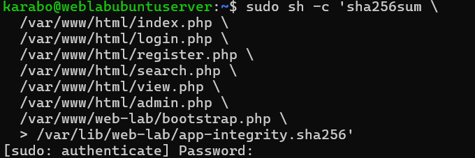
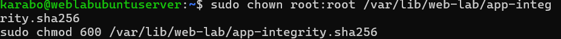
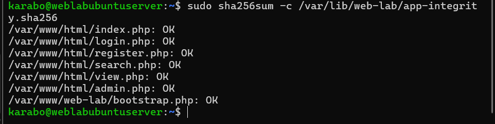
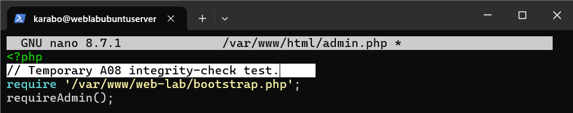
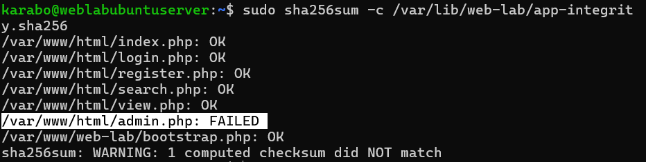
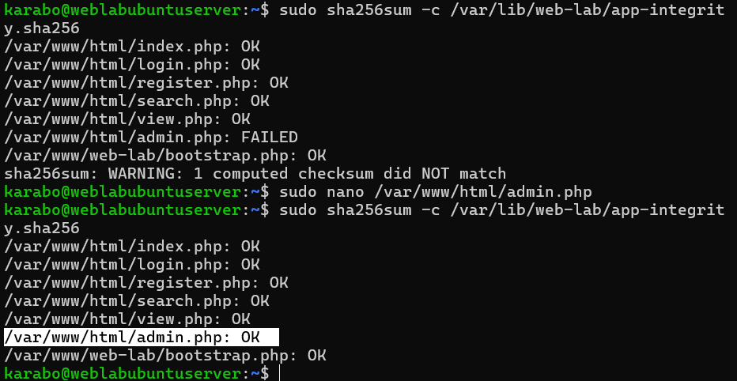

# A08 — Software or Data Integrity Failures

## Executive summary

This exercise examined how a trusted cryptographic fingerprint can reveal unauthorized or unexpected changes to application code. I created a SHA-256 integrity manifest for the public PHP entry points and the application's private security bootstrap file, protected the manifest with restrictive ownership and permissions, and verified that every file initially matched its known-good fingerprint.

I then added one harmless comment to `admin.php`. The application continued to work, but the next integrity check reported `admin.php: FAILED`, proving that even a one-line content change altered its fingerprint. I removed the comment, repeated the check and confirmed that every protected file returned to `OK`.

The exercise demonstrated detection rather than prevention: a checksum can show that a file changed, but it cannot determine whether the change was authorized, explain why it changed, restore the file or stop an attacker who can also replace the trusted manifest.

## Classification

| Item | Details |
| --- | --- |
| OWASP category | A08:2025 — Software or Data Integrity Failures |
| Tested control | SHA-256 integrity verification of application source files |
| Threat model | Application code is modified, replaced or damaged without being noticed |
| Protected components | Public PHP files and private `bootstrap.php` security logic |
| Security property | Integrity |
| Result | Baseline verified, controlled change detected, original file restored and clean state reverified |

## Scope and authorization

The exercise was performed only against my own PHP and SQLite notes application in an isolated VirtualBox training environment. The server, application files and integrity manifest were under my control. The modification was a harmless PHP comment that did not alter application behaviour.

No third-party software, public website or external system was modified. No malicious code was introduced.

## Lab environment

| Component | Purpose |
| --- | --- |
| VirtualBox | Hosted the isolated Ubuntu Server clone |
| Ubuntu Server | Stored the application and integrity manifest |
| Apache and PHP | Served and executed the protected application files |
| SHA-256 | Produced deterministic fingerprints of file contents |
| SSH through PowerShell | Provided authorized administrative access |
| Host-Only network | Kept the exercise isolated |

Kali Linux was unnecessary because this exercise focused on server-side file-integrity verification rather than network exploitation.

## Learning objectives

The exercise asked:

1. How can an administrator record a known-good fingerprint of application code?
2. Which files should be included when both public entry points and private shared controls affect security?
3. Can a harmless one-line change be detected?
4. Can restoring the original content return the integrity check to a clean state?
5. What can a checksum prove, and what remains outside its capabilities?

## Files included in the integrity baseline

The manifest covered the following files:

```text
/var/www/html/index.php
/var/www/html/login.php
/var/www/html/register.php
/var/www/html/search.php
/var/www/html/view.php
/var/www/html/admin.php
/var/www/web-lab/bootstrap.php
```

The files under `/var/www/html/` are public application entry points that Apache executes in response to browser requests. Changes to them could alter input handling, authentication flows, note access or administrator functionality.

`bootstrap.php` is outside the public web root, but it remains security-critical because the public pages include and depend on it. It contains or supports shared controls such as:

- Database connectivity
- Session configuration
- Authentication through `requireLogin()`
- Administrator authorization through `requireAdmin()`
- CSRF protection
- Output encoding
- Security audit logging

An unauthorized change to this private helper could affect multiple application pages at once. Browser accessibility was therefore not the criterion for inclusion; security impact was.

The SQLite database was not included in the fixed manifest because it legitimately changes when users register, log in or create notes. A permanent checksum would report expected data activity as a mismatch. Database access controls, backups and transaction integrity are more suitable controls for that changing data.

## Creating the trusted manifest

I generated SHA-256 fingerprints and wrote them to a manifest outside the public web root:

```bash
sudo sh -c 'sha256sum \
  /var/www/html/index.php \
  /var/www/html/login.php \
  /var/www/html/register.php \
  /var/www/html/search.php \
  /var/www/html/view.php \
  /var/www/html/admin.php \
  /var/www/web-lab/bootstrap.php \
  > /var/lib/web-lab/app-integrity.sha256'
```



The manifest stores fingerprints and paths, not copies of the original files. During verification, `sha256sum` recalculates each current fingerprint and compares it with the trusted value.

```text
Original contents → trusted SHA-256 fingerprint
Current contents  → newly calculated fingerprint

Same value      → OK
Different value → FAILED
```

## Protecting the baseline

I restricted the manifest to the server administrator:

```bash
sudo chown root:root /var/lib/web-lab/app-integrity.sha256
sudo chmod 600 /var/lib/web-lab/app-integrity.sha256
```



Mode `600` gives `root` read and write access while denying access to the group and everyone else. Storing the manifest under `/var/lib/web-lab/` also keeps it outside Apache's public document root.

These permissions reduce ordinary application-level tampering, but they do not protect the baseline from an attacker who gains root-level control of the server.

## Secure baseline verification

I checked the protected files against the manifest:

```bash
sudo sha256sum -c /var/lib/web-lab/app-integrity.sha256
```

Every file returned `OK`, establishing that the current application matched the known-good baseline.



## Controlled integrity change

To create a safe mismatch, I added this comment to `admin.php`:

```php
// Temporary A08 integrity-check test.
```



The comment did not change how the administrator page worked. It changed only the contents of the file, which was sufficient to produce a different SHA-256 fingerprint.

I deliberately did not recreate or update the manifest after changing the file. Replacing the trusted fingerprint at that stage would have accepted the modified file as the new baseline and hidden the mismatch.

## Detection result

I ran the same verification command again. All untouched files continued to report `OK`, while `admin.php` reported `FAILED` and `sha256sum` warned that one computed checksum did not match.



This isolated result showed exactly which protected file had changed. The tool did not claim that the modification was malicious; it reported only that the current contents no longer matched the trusted baseline.

## Remediation and retest

I removed only the temporary comment from `admin.php`, saved the restored file and ran the original verification command again.

Every protected file, including `admin.php`, returned to `OK`.



The restored secure state was preserved in the VirtualBox snapshot:

```text
a08-integrity-restored-and-verified
```

## Test methodology

1. Selected stable application files whose contents should not change during normal use.
2. Created a SHA-256 manifest outside the public web root.
3. Restricted the manifest to `root` with mode `600`.
4. Verified that every protected file matched the trusted baseline.
5. Preserved the verified baseline state.
6. Added one harmless comment to `admin.php`.
7. Repeated the integrity check and observed `admin.php: FAILED`.
8. Left the manifest unchanged so it continued to represent the trusted state.
9. Removed the temporary comment.
10. Repeated the same verification command and confirmed that every file returned to `OK`.
11. Snapshotted the restored and verified state.

## Security impact

Application-file tampering could weaken authentication or authorization, expose private information, introduce malicious functionality, disable logging or create a persistent backdoor. A change to a shared file such as `bootstrap.php` could affect many application routes simultaneously.

An integrity check improves visibility by distinguishing the current files from a known-good state. This can help an administrator investigate unexpected changes before continuing to trust or deploy the affected code.

## What this control does not prove

A matching SHA-256 fingerprint provides evidence that the checked file contents match the recorded baseline. It does not prove that:

- The original baseline was secure or free of vulnerabilities.
- A detected change was unauthorized or malicious.
- No compromise occurred elsewhere on the system.
- The manifest itself was not replaced by a sufficiently privileged attacker.
- The correct files were selected for monitoring.
- The application is currently behaving securely.

The check also does not prevent a change, restore files automatically, identify the person responsible or generate an alert by itself.

## Recommendations

- Store trusted baselines separately from the monitored server where practical.
- Use signed deployment artifacts or releases to verify both integrity and source authenticity.
- Protect source-control accounts and require review for security-sensitive changes.
- Run integrity checks automatically and send unexpected mismatches to monitoring and alerting systems.
- Include security-critical private helpers and configuration, not only browser-accessible files.
- Investigate mismatches before updating the trusted baseline.
- Recreate the baseline only after an authorized, reviewed deployment.
- Retain known-good source or backups so affected files can be restored safely.
- Continue using file ownership and least privilege to reduce unauthorized modification.

## Lessons learned

This exercise showed me that integrity is about maintaining confidence that software remains in an expected state. A file does not need to stop working for its integrity to change; a single harmless comment was enough to produce a different SHA-256 fingerprint.

I also learned that private shared code can be more security-sensitive than a visible page. Hashing `bootstrap.php` was important because authentication, authorization, sessions, CSRF protection and logging depend on it. Finally, the exercise demonstrated why the baseline must be protected and independently trusted: if an attacker can modify both the application and its recorded fingerprints, a local comparison may incorrectly report a clean result.

## Related documentation

- [A01 — Broken Access Control](A01-broken-access-control.md)
- [A02 — Security Misconfiguration](A02-security-misconfiguration.md)
- [A03 — Software Supply Chain Failures](A03-software-supply-chain-failures.md)
- [A04 — Cryptographic Failures](A04-cryptographic-failures.md)
- [A05 — Injection](A05-injection.md)
- [A06 — Insecure Design](A06-insecure-design.md)
- [A07 — Authentication Failures](A07-identification-and-authentication-failures.md)
- [A09 — Security Logging and Alerting Failures](A09-security-logging-and-alerting-failures.md)
- [Security design](../Web-application-architecture/06-security-design.md)
- [OWASP Top 10:2025 — A08 Software or Data Integrity Failures](https://top10.owasp.org/2025/A08_2025-Software_or_Data_Integrity_Failures/)
