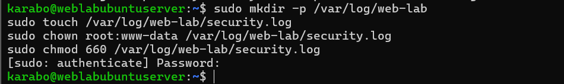
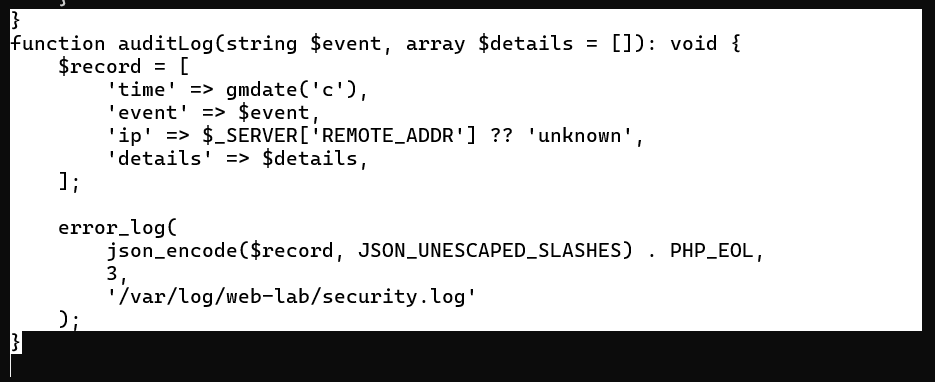
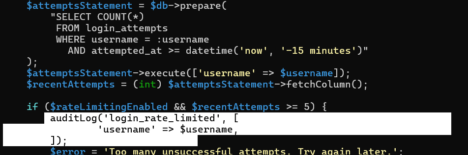
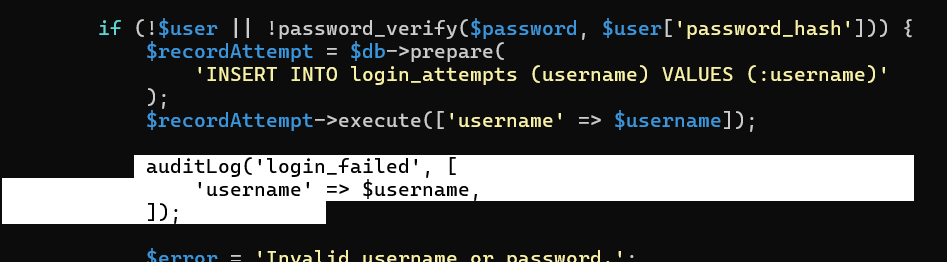
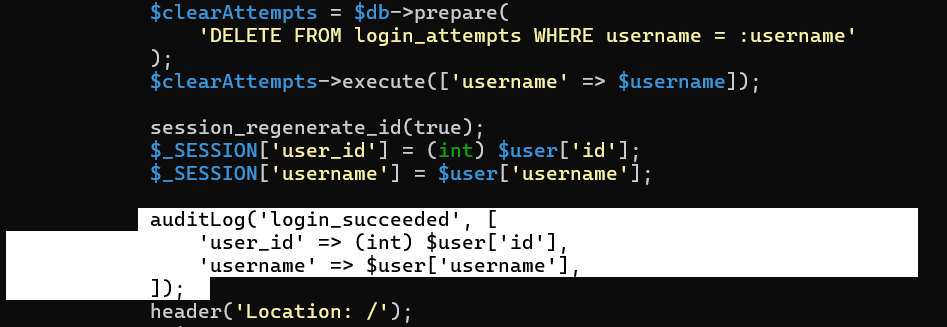
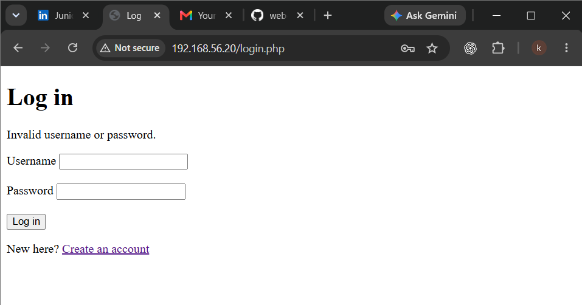
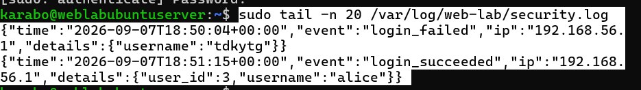

# A09 — Security Logging and Alerting Failures

## Executive summary

This exercise examined how an application can record meaningful authentication activity without exposing sensitive information. I created a protected security log outside the public web root, added a reusable structured logging function to the private application bootstrap file, connected it to the login workflow, and generated both failed and successful login events.

The resulting JSON records contained a UTC timestamp, event type, source IP address and safe account context. They did not contain passwords, session identifiers, CSRF tokens or database credentials. I inspected the log through an administrative terminal and confirmed that the expected events were present.

Unlike my other OWASP exercises, I did not deliberately disable logging or create a vulnerable failure state. This report therefore documents a secure logging implementation and validation exercise. Automated alerting was not implemented or tested.

## Classification

| Item | Details |
| --- | --- |
| OWASP category | A09:2025 — Security Logging and Alerting Failures |
| Tested control | Structured audit logging for authentication activity |
| Events implemented | Failed login, successful login and rate-limit block |
| Affected components | `bootstrap.php`, `login.php` and `/var/log/web-lab/security.log` |
| Security objectives | Accountability, traceability and incident investigation |
| Result | Protected logging implemented and failed/successful login events validated |
| Not tested | Deliberately disabled logging, log tampering, rotation, centralized collection and automated alerting |

## Scope and authorization

The work was performed only against my own PHP and SQLite notes application in an isolated VirtualBox lab. The server, application, accounts and log file were under my control. No public service, third-party account or external system was tested.

The validation used ordinary login activity. No password, session token or other secret was intentionally written to the security log.

## Lab environment

| Component | Purpose |
| --- | --- |
| VirtualBox | Hosted the isolated Ubuntu Server clone |
| Ubuntu Server | Hosted the application and protected log |
| Apache and PHP | Processed authentication requests and generated audit events |
| SQLite | Stored accounts and login-attempt records |
| Windows browser | Generated controlled failed and successful login events |
| SSH through PowerShell | Provided administrative access to create and inspect the log |
| Host-Only network | Kept the exercise isolated |

Kali Linux was not required because the learning objective concerned server-side event recording rather than traffic interception or exploit tooling.

## Learning objectives

The exercise asked:

1. Which authentication events would be useful during an investigation?
2. Where should an application security log be stored?
3. Which details provide useful context without creating a new sensitive-data risk?
4. Can the application record failed and successful logins in a consistent, reviewable format?

## Protected log storage

I created a dedicated log directory and file:

```bash
sudo mkdir -p /var/log/web-lab
sudo touch /var/log/web-lab/security.log
sudo chown root:www-data /var/log/web-lab/security.log
sudo chmod 660 /var/log/web-lab/security.log
```



The resulting design gives the owner and Apache's `www-data` group read/write access while denying access to everyone else. The log is stored outside `/var/www/html/`, so it is not a browser-addressable application resource.

## Structured logging implementation

I added a reusable helper to the private `/var/www/web-lab/bootstrap.php` file:

```php
function auditLog(string $event, array $details = []): void {
    $record = [
        'time' => gmdate('c'),
        'event' => $event,
        'ip' => $_SERVER['REMOTE_ADDR'] ?? 'unknown',
        'details' => $details,
    ];

    error_log(
        json_encode($record, JSON_UNESCAPED_SLASHES) . PHP_EOL,
        3,
        '/var/log/web-lab/security.log'
    );
}
```



The function creates one JSON object per line. UTC timestamps make events easier to correlate consistently, the event name identifies what happened, the source IP supplies network context, and the details array holds only explicitly selected safe information.

The private bootstrap file was owned by `root:www-data` with mode `640`, allowing the administrator to modify it and Apache to read it without making it generally accessible.

## Authentication events

### Rate-limit block

The login rate-limit branch records the attempted username when the application blocks excessive attempts:

```php
auditLog('login_rate_limited', [
    'username' => $username,
]);
```



### Failed login

After recording an unsuccessful authentication attempt in the database, the application records a `login_failed` event:

```php
auditLog('login_failed', [
    'username' => $username,
]);
```



### Successful login

After regenerating the session identifier and establishing the authenticated session, the application records the authenticated user ID and username:

```php
auditLog('login_succeeded', [
    'user_id' => (int) $user['id'],
    'username' => $user['username'],
]);
```



The calls were deliberately placed inside the branches where each outcome was already known. This prevents a success from being logged before authentication finishes or a failure from being logged for a request that was never evaluated.

## Validation methodology

1. Created the protected log directory and file outside the public web root.
2. Applied restricted ownership and permissions.
3. Added the structured `auditLog()` helper to `bootstrap.php`.
4. Validated the PHP syntax.
5. Added logging calls to the rate-limit, failed-login and successful-login branches.
6. Submitted one controlled incorrect login through the browser.
7. Submitted one successful login.
8. Reviewed the latest records with administrative access using `tail`.
9. Checked that the records contained useful context and did not contain passwords or session data.



## Validation result

The security log contained separate structured events for the failed and successful login attempts. Each record included the expected timestamp, event name, source IP address and safe details.



The observed result confirmed that the application could produce reviewable authentication evidence. The screenshot contains only private lab addresses and test-account identifiers; it does not contain authentication secrets.

## Sensitive-data handling

The logger intentionally did not record:

- Submitted passwords or password hashes
- PHP session identifiers or cookies
- CSRF tokens
- Database credentials
- Full request bodies
- Private notes

Logging these values would turn a defensive record into another source of sensitive-data exposure. The implementation passes a small allowlist of safe contextual fields to the logger instead of automatically recording all request data.

## Security value

Authentication logs can help an administrator answer questions such as:

- When did a login succeed or fail?
- Which account name was involved?
- Which source address generated the request?
- Did the application activate its rate limit?
- Do several related events suggest repeated account-access attempts?

Without reliable logs, suspicious activity may occur without leaving enough evidence for investigation. Logging does not prevent an attack by itself, but it improves detection, investigation and accountability.

## Methodology limitation

I chose not to create a deliberately broken logging state for this exercise. Therefore, the work did not demonstrate an attacker exploiting absent logs, and it did not include a repair/retest comparison.

The confirmed sequence was:

```text
Define useful security events
        ↓
Create protected log storage
        ↓
Implement structured audit logging
        ↓
Generate authentication activity
        ↓
Inspect and validate the resulting records
```

This report must not be interpreted as proof of a complete monitoring program. Automated alerting, retention, rotation, integrity monitoring and centralized collection remain future work.

## Recommendations and future improvements

- Add events for logout, account creation, note deletion and authorization denials.
- Add a specific record when CSRF validation fails, without logging the token.
- Configure log rotation and an appropriate retention policy.
- Prevent unauthorized modification and monitor the log for tampering.
- Send logs to a centralized system if the application grows beyond one server.
- Define alert conditions for repeated failures, rate-limit blocks and unusual success patterns.
- Use consistent event names and timestamps across the application.
- Test failure handling so that a logging problem does not expose technical details or break authentication.
- Review logs regularly and document who is authorized to access them.

## Lessons learned

This exercise showed me that effective logging is a deliberate security design decision. Recording every available value is unsafe, while recording too little makes investigation difficult. Useful logs capture a meaningful event, its time, its source and carefully selected context.

I also learned that the log file is itself a security asset. It must be stored outside the public web root and protected with appropriate ownership and permissions. Finally, logging and alerting are different controls: I implemented and validated logging, but alerting still needs separate rules and a mechanism that actively notifies an administrator.

## Related documentation

- [A01 — Broken Access Control](A01-broken-access-control.md)
- [A02 — Security Misconfiguration](A02-security-misconfiguration.md)
- [A05 — Injection](A05-injection.md)
- [A07 — Authentication Failures](A07-identification-and-authentication-failures.md)
- [Remote administration with SSH](../Web-application-architecture/03-remote-administration-with-ssh.md)
- [Security design](../Web-application-architecture/06-security-design.md)
- [OWASP Top 10:2025 — A09 Security Logging and Alerting Failures](https://owasp.org/Top10/2025/A09_2025-Security_Logging_and_Alerting_Failures/)
