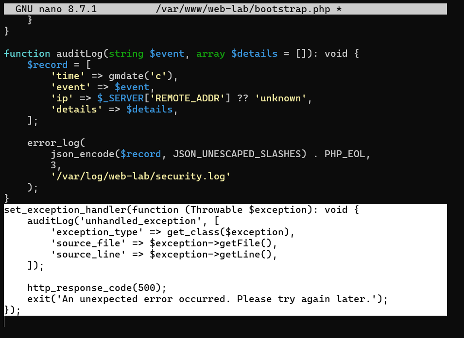
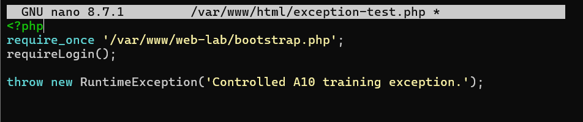
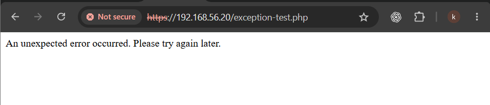
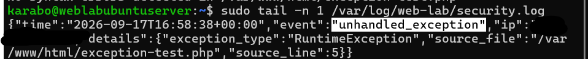

# A10 — Mishandling of Exceptional Conditions

## Executive summary

This exercise examined how the notes application responds when an unexpected server-side exception occurs. I added a global exception handler to the private application bootstrap file, generated one controlled exception through an authenticated test page, and compared what the user saw with what the server recorded.

The browser received a generic error message and HTTP 500 response instead of an exception message, stack trace or filesystem details. At the same time, the protected security log recorded the exception type, source file and source line for administrative investigation. I then removed the temporary test page, regenerated the application integrity manifest and verified the final file set.

## Classification

| Item | Details |
| --- | --- |
| OWASP category | A10:2025 — Mishandling of Exceptional Conditions |
| Tested control | Centralized, fail-closed handling of unhandled PHP exceptions |
| Affected component | `/var/www/web-lab/bootstrap.php` |
| Test component | Temporary `/var/www/html/exception-test.php` page |
| Security objectives | Prevent information disclosure while preserving diagnostic evidence |
| Result | Generic client response and protected internal event confirmed |

## Scope and authorization

The exercise was performed only against my own PHP and SQLite notes application inside an isolated VirtualBox lab. The server, application, account and log file were under my control. No public or third-party system was tested.

## Learning objectives

The exercise asked whether the application could fail without revealing internal details to the user, preserve useful diagnostic evidence for the administrator, return an appropriate status, and safely remove its temporary test component.

## Secure implementation

I added a global exception handler after the existing `auditLog()` helper in `bootstrap.php`:

```php
set_exception_handler(function (Throwable $exception): void {
    auditLog('unhandled_exception', [
        'exception_type' => get_class($exception),
        'source_file' => $exception->getFile(),
        'source_line' => $exception->getLine(),
    ]);

    http_response_code(500);
    exit('An unexpected error occurred. Please try again later.');
});
```



The handler records selected technical context but excludes the full exception message, request body, passwords, cookies and session identifiers. It then returns HTTP 500 and stops execution, which is a fail-closed response.

## Controlled validation methodology

1. Took the `a10-exception-handling-baseline` VirtualBox snapshot.
2. Added the global exception handler to the private bootstrap file.
3. Created a temporary authenticated page that threw a controlled `RuntimeException`.
4. Requested the page through the browser.
5. Confirmed that the browser showed only the generic message.
6. Confirmed an `unhandled_exception` event in the protected security log.
7. Removed the temporary page.
8. Regenerated the SHA-256 application integrity manifest and verified the recorded files.
9. Took the `a10-exception-handling-fixed-and-verified` snapshot.



## Results

The browser displayed the generic response without a stack trace, PHP warning, filesystem path or exception details:



The protected log retained the technical event needed for investigation:



The screenshot redacts the private lab IP address. The record contains the event type, exception class, source file and line, but no authentication secret.

## Security value and limitations

Poor exception handling can expose paths, frameworks, queries or internal logic. It may also allow uncertain execution after a failure. This implementation separates the audiences: the user receives a safe, consistent response while the administrator receives restricted diagnostic context.

The exercise validated one unhandled PHP exception. It did not test database unavailability, filesystem exhaustion, logging failure, malformed upstream responses or partial transactions. Automated exception alerting was not implemented.

## Recommendations

- Keep PHP error display disabled outside development.
- Add controlled handling for expected database, file and network failures.
- Prevent sensitive values from entering user-facing errors or logs.
- Monitor repeated exception events and add alert thresholds.
- Test logging failure and storage exhaustion without recursive errors.
- Use transactions where an interrupted operation could leave inconsistent data.

## Lessons learned

This exercise showed me that secure exception handling requires two responses. The user needs a simple message that does not reveal internals, while the administrator needs protected context for investigation. The correct status code, safe termination, structured logging, removal of test components and integrity verification are all part of the control.

## Related documentation

- [A09 — Security Logging and Alerting Failures](A09-security-logging-and-alerting-failures.md)
- [Supplemental SSRF Exercise](Supplemental-SSRF.md)
- [Security design](../Web-application-architecture/06-security-design.md)
- [OWASP Top 10:2025 — A10 Mishandling of Exceptional Conditions](https://owasp.org/Top10/2025/A10_2025-Mishandling_of_Exceptional_Conditions/)

