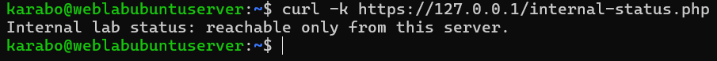
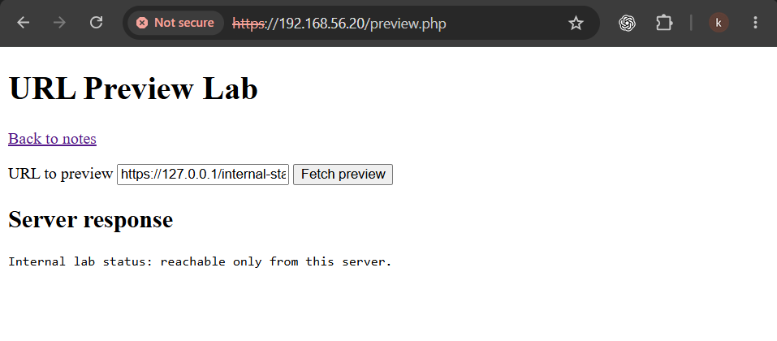
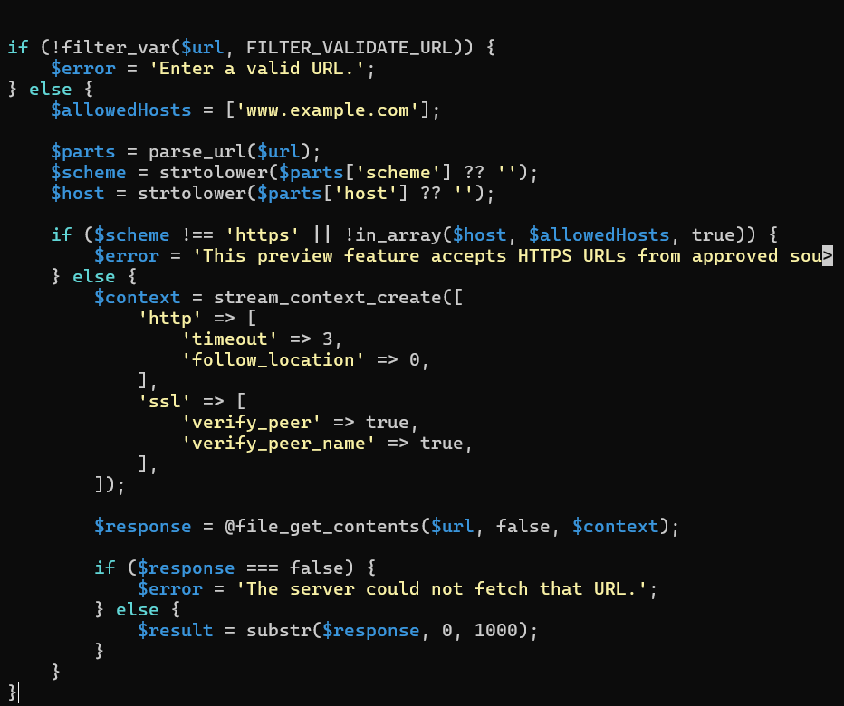
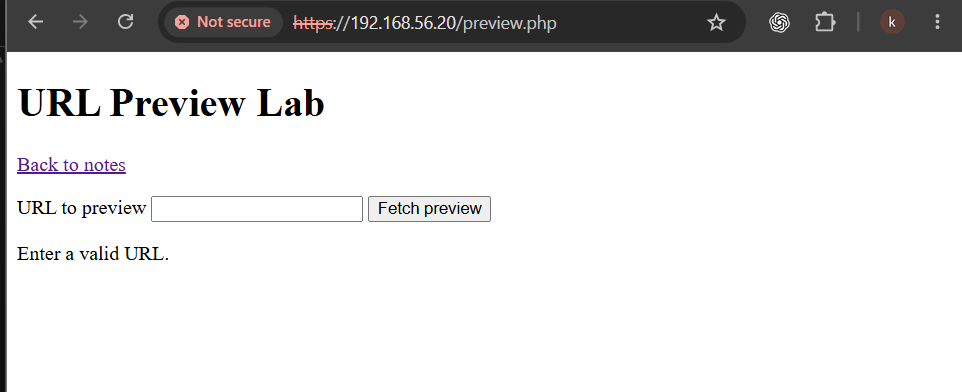

# Supplemental Exercise — Server-Side Request Forgery

## Executive summary

This supplemental exercise examined Server-Side Request Forgery (SSRF) through a deliberately vulnerable URL-preview feature. The feature accepted a user-supplied URL and asked the Ubuntu server to fetch it. While logged in, I supplied the address of a harmless localhost-only status page. The preview feature returned that internal response to the browser, proving that the server could be induced to reach a resource the browser could not access directly.

I remediated the weakness by accepting only HTTPS URLs whose parsed hostname exactly matched an explicit allow-list, keeping redirects disabled and restoring TLS certificate verification. This exercise is separate because SSRF was A10 in the 2021 OWASP Top 10, but is not the numbered A10 category in the 2025 edition used by the main report set.

## Classification

| Item | Details |
| --- | --- |
| Exercise | Supplemental Server-Side Request Forgery test |
| Historical mapping | OWASP Top 10:2021 A10 — SSRF |
| Current report-set mapping | Not numbered as A10 in the OWASP Top 10:2025 set |
| Vulnerable component | `/var/www/html/preview.php` |
| Harmless internal target | `/var/www/html/internal-status.php` restricted to localhost |
| Result | Internal fetch reproduced; allow-list remediation implemented |

## Scope and authorization

All requests targeted my own disposable Ubuntu Server clone on an isolated VirtualBox network. The two pages were created specifically for this exercise. No cloud metadata endpoint, public service, third-party host or real administration interface was targeted.

## Controlled vulnerable design

`internal-status.php` returned a harmless message only when the request originated from `127.0.0.1` or `::1`. The authenticated and CSRF-protected `preview.php` page accepted a URL and used `file_get_contents()` to fetch it from the server. Those access controls protected the form but did not decide where the server could connect. Redirects were disabled and a short timeout limited the test, but missing destination authorization remained the root weakness.

## Test methodology and result

1. Confirmed locally that the harmless endpoint responded from the server.
2. Logged into the notes application and opened the preview feature.
3. Submitted `https://127.0.0.1/internal-status.php`.
4. Observed the internal response in the browser.

The result proved SSRF because the application server, not the user's browser, made the request to `127.0.0.1` and returned the response.

## Root cause and impact

The feature treated a syntactically valid URL as an authorized destination. Format validation cannot decide whether the server should connect to a scheme, hostname or address.

In a real environment, SSRF may reach localhost services, internal network interfaces or cloud metadata endpoints. Depending on the service, this could expose information or trigger unintended actions. This lab demonstrated only a harmless read from a purpose-built status page.

## Remediation

I replaced unrestricted destination handling with an explicit policy:

- Accept only `https` URLs.
- Parse and normalize the hostname, then compare it with an exact allow-list.
- Reject unapproved destinations, including `127.0.0.1`.
- Keep redirects disabled.
- Enable TLS peer and hostname verification.
- Retain a short timeout and limit displayed response size.

The browser evidence shows the remediated page returning a validation error. A dedicated screenshot of the rejected localhost submission was not retained, so the evidence is described without overstating what that image alone proves.

## Limitations and further hardening

A production implementation would also need defenses for DNS rebinding, alternative IP representations, IPv6 edge cases and changes in resolved addresses. Network egress controls should provide another layer. If arbitrary destinations are required, resolution and connection handling need stricter IP-range checks than this exercise implemented.

## Lessons learned

This exercise showed me that input validation and authorization answer different questions. A URL can be correctly formatted and still be dangerous. The application must decide which destinations the server is authorized to reach. SSRF is a server-side trust-boundary problem because the attacker controls the destination while the request inherits the server's network position.

## Related documentation

- [A02 — Security Misconfiguration](A02-security-misconfiguration.md)
- [A04 — Cryptographic Failures](A04-cryptographic-failures.md)
- [A10 — Mishandling of Exceptional Conditions](A10-mishandling-of-exceptional-conditions.md)
- [OWASP Server-Side Request Forgery Prevention Cheat Sheet](https://cheatsheetseries.owasp.org/cheatsheets/Server_Side_Request_Forgery_Prevention_Cheat_Sheet.html)

